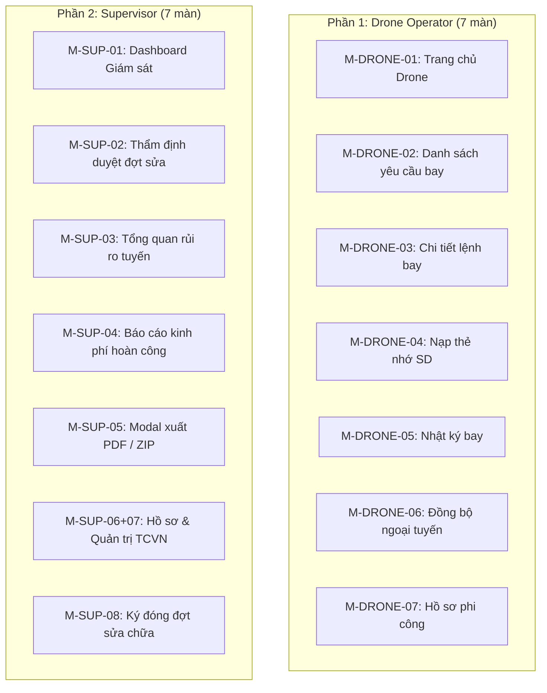

---
# RoadGuard FE_AppMobile — Kế hoạch Person 2 (Hoàng)
> **Người thực hiện:** Hoàng (Person 2)  
> **Phân công chính thức:** **Drone Operator (7 màn) + Supervisor (7 màn) = Tổng cộng 14 màn hình**  
> **Lưu ý đổi vai:** Phân khu **Repair Crew (10 màn)** đã được Person 1 (Tùng) đảm nhận và **hoàn thành 100%**. Hoàng không cần làm phần Crew.  
> **Điều kiện nhận bàn giao:** Kéo code từ nhánh `develop` (hoặc `tung`) — App chạy mượt, Auth & Repair Crew hoàn chỉnh, Drone & Sup đã có sẵn khung chờ (placeholder) để Hoàng code.

---

## 🧭 BẢN ĐỒ 14 MÀN HÌNH HOÀNG CẦN LÀM



---

## 🚀 HƯỚNG DẪN BẮT ĐẦU CHO HOÀNG

```bash
# 1. Kéo code mới nhất từ nhánh develop về
git clone https://github.com/tungnvse182691/FE_Drone_Mobile.git
cd FE_Drone_Mobile
git checkout -b hoang origin/develop

# 2. Cài thư viện & khởi chạy
npm install
npx expo start
```
* Bấm phím **`a`** để mở app trên máy ảo Android.
* **Tài khoản Drone:** `drone@cattuong.vn` | Mk: `123456`
* **Tài khoản Supervisor:** `sup@cattuong.vn` | Mk: `123456`

> **TÀI LIỆU CẦN ĐỌC TRƯỚC KHI CODE (ĐÃ CÓ TRONG REPO):**
> 1. `AGENTS.md` — Hiến pháp repo, các điều CẤM TUYỆT ĐỐI.
> 2. `docs/specs/Wireframe_Specification.md` — Đặc tả chi tiết từng pixel, nút bấm, layout của 40 màn hình.
> 3. `docs/specs/Mo_ta_chi_tiet_cac_luong_RoadGuard_v2.md` — Chi tiết các luồng nghiệp vụ.
> 4. `src/design-tokens.ts` — Màu sắc (Primary `#C9A227`), Typography, Spacing.

---

## 🚁 PHẦN 1 — Phân khu Phi Công Drone `(drone)` — 7 màn

> **Vị trí code:** Thư mục `app/(drone)/*` (Đã có sẵn file placeholder, Hoàng chỉ việc code hoàn thiện UI & logic).  
> **Nhân vật mẫu:** Phi công Nguyễn Văn An — Mã NV: `CT-2089` (Đội Khảo sát Số 1).

- [ ] **1.1** `app/(drone)/_layout.tsx` — BottomNav 4 tab: Trang chủ / Yêu cầu / Nhật ký / Hồ sơ
- [ ] **1.2** `app/(drone)/home.tsx` — **M-DRONE-01**: Trang chủ Phi công (Pin TB65 92%, thời tiết, 01 đang bay, 02 chờ bay)
- [ ] **1.3** `app/(drone)/requests.tsx` — **M-DRONE-02**: Danh sách Yêu cầu bay (3 tab: Chờ nhận, Đang bay, Đã xong)
- [ ] **1.4** `app/(drone)/request-detail.tsx` — **M-DRONE-03**: Chi tiết Yêu cầu bay `#REQ-KS-089` (Cao độ 45m, video 4K 60fps, nút Bắt đầu / Từ chối có lý do KS03)
- [ ] **1.5** `app/(drone)/upload.tsx` — **M-DRONE-04**: Nạp Video & File SRT từ Thẻ nhớ SD (Kiểm tra GPS metadata, SHA-256)
- [ ] **1.6** `app/(drone)/log.tsx` — **M-DRONE-05**: Nhật ký Chuyến bay `#FL-20231024-01` (Thời gian 24 phút, 420 ảnh trực giao, SHA-256)
- [ ] **1.7** `app/(drone)/sync.tsx` — **M-DRONE-06**: Hàng đợi Đồng bộ Ngoại tuyến (Background Sync Queue, dọn dẹp an toàn sau đối soát)
- [ ] **1.8** `app/(drone)/profile.tsx` — **M-DRONE-07**: Hồ sơ Phi công Nguyễn Văn An (128h bay tích lũy, đổi mật khẩu & Đăng xuất)

**📝 Nghiệm thu Phần 1:** Chạy `npm run typecheck` đạt 0 lỗi ➜ Test luồng trên Android: Home ➜ Nhận yêu cầu ➜ Nạp video SD ➜ Ghi nhật ký ➜ Đồng bộ.

---

## 🛡️ PHẦN 2 — Phân khu Giám Sát Viên Supervisor `(sup)` — 7 màn

> **Vị trí code:** Thư mục `app/(sup)/*`.  
> **Nhân vật mẫu:** Giám sát trưởng Trần Thế Hùng — Mã NV: `NV-8842` (Ban QLDA Miền Đông).

- [ ] **2.1** `app/(sup)/_layout.tsx` — BottomNav 4 tab: Trang chủ / Phê duyệt / Báo cáo / Hồ sơ
- [ ] **2.2** `app/(sup)/home.tsx` — **M-SUP-01**: Dashboard Giám sát viên (Rủi ro cao: 2, Chờ duyệt: 5, Đã xong: 18)
- [ ] **2.3** `app/(sup)/approve.tsx` — **M-SUP-02**: Thẩm định & Phê duyệt Đợt sửa `#REQ-045` (42.500.000 VNĐ, Chấp thuận / Từ chối kèm lý do)
- [ ] **2.4** `app/(sup)/risk.tsx` — **M-SUP-03**: Tổng quan Rủi ro Dự án Tuyến đường (Theo dõi 6 tuyến, 12 điểm đen lún sụt)
- [ ] **2.5** `app/(sup)/reports.tsx` — **M-SUP-04**: Báo cáo & Thống kê Kinh phí (18 việc hoàn thành, kinh phí duyệt 648 triệu, 100% đạt)
- [ ] **2.6** `app/(sup)/export-modal.tsx` — **M-SUP-05**: Modal Xuất Hồ sơ Hoàn công (Tùy chọn PDF bản in / ZIP bằng chứng)
- [ ] **2.7** `app/(sup)/profile.tsx` — **M-SUP-06 + M-SUP-07 GỘP**: Hồ sơ Giám sát trưởng + Tab Quản trị danh mục tiêu chuẩn kỹ thuật TCVN & Cấu hình Legal Hold
  > ⚠️ **Quy tắc:** KHÔNG tạo file `sup-07.tsx` riêng — tích hợp Tab quản trị vào bên trong `profile.tsx`.
- [ ] **2.8** `app/(sup)/signoff.tsx` — **M-SUP-08**: Ký duyệt Đóng Đợt Sửa Chữa (Chữ ký điện tử vẽ bằng cảm ứng tay)

**📝 Nghiệm thu Phần 2:** Chạy `npm run typecheck` đạt 0 lỗi ➜ Test luồng trên Android: Home ➜ Thẩm định duyệt #REQ-045 ➜ Xem rủi ro ➜ Xuất báo cáo ➜ Ký đóng đợt.

---

## ⚠️ 3 NGUYÊN TẮC BẮT BUỘC ĐỂ KHÔNG BỊ LỖI
1. **Full Group Prefix:** Bắt buộc dùng `router.push('/(drone)/home')` hoặc `router.push('/(sup)/home')` (Có ngoặc tròn). Cấm dùng `/drone/...` hoặc `/sup/...`.
2. **1 Nút Vàng CTA:** Chỉ dùng màu vàng `#C9A227` cho duy nhất 1 nút hành động chính trên mỗi màn hình.
3. **Chỉ đẩy lên nhánh của bạn:**
   ```bash
   git add .
   git commit -m "feat(drone): hoàn thành màn M-DRONE-01"
   git push origin hoang
   ```
   *(Tuyệt đối không push lên `tung`, `develop` hay `main`).*
