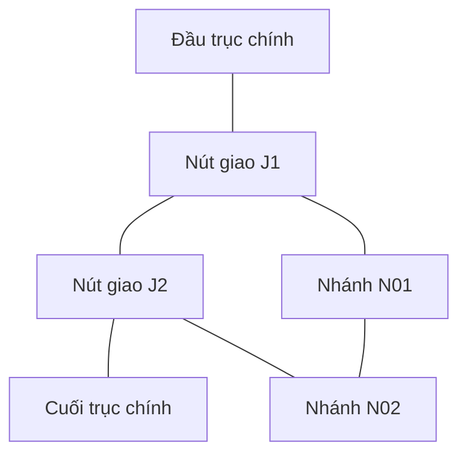
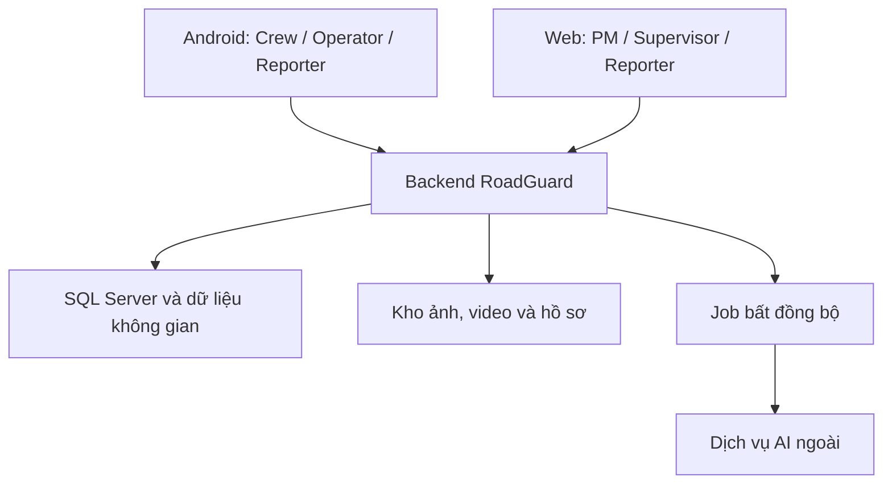

# ROADGUARD — MÔ TẢ CHI TIẾT DỰ ÁN

**Mã tài liệu:** RG-PROJECT-DESCRIPTION-2026-09-26-R1  
**Thời điểm tổng hợp:** 26/09/2026, theo cuộc trao đổi đến 15:30, giờ Việt Nam.  
**Mục đích:** mô tả sản phẩm, vai trò, dữ liệu và luồng nghiệp vụ trước khi chỉnh UseCase.  
**Phạm vi:** tài liệu tổng hợp quyết định làm nền cho bộ đặc tả R3. Theo các yêu cầu tiếp theo, UseCase, User Stories và Data Dictionary đã được đồng bộ cùng FRD/SRS, Business Rules và To-Be Process; xem log chung. Không sửa code, migration hoặc trạng thái công việc backend.

> Nguyên tắc trung tâm: PM quyết định cách kiểm chứng, tổ chức đợt đo, phương án và thứ tự sửa để tối ưu chi phí. Hệ thống cung cấp dữ liệu và gợi ý; Crew chỉ tự sửa trong nhiệm vụ được PM cho phép và theo policy. Một công việc đã sửa chỉ được đóng sau khi có bằng chứng và xác nhận đúng thẩm quyền.

## Cách đọc và mức độ xác nhận

Tài liệu sử dụng bốn nhãn:

- **[CHỐT]**: quyết định trực tiếp của chủ dự án trong cuộc trao đổi; quyết định mới nhất thay thế quyết định cũ ở cùng nội dung.
- **[KẾ THỪA]**: yêu cầu từ tài liệu nền đang được giữ để mô tả đầy đủ dự án; không có nghĩa mọi chi tiết thiết kế cũ đã được chủ dự án duyệt lại.
- **[ĐỀ XUẤT]**: hướng xử lý hoặc thiết kế để hoàn thiện luồng; chưa được biến thành quyết định của chủ dự án.
- **[CẦN CHỐT]**: thiếu lựa chọn, dữ liệu mẫu hoặc tiêu chí cụ thể trước khi triển khai phần liên quan.

Đối với mục có nhiều nhãn, nhãn tại từng đoạn/bảng được ưu tiên. Các tên entity hiện có dùng để liên hệ tài liệu cũ; tên mới chỉ là khái niệm nghiệp vụ, chưa bắt buộc tạo bảng/API tương ứng.

**Thứ tự căn cứ:** quyết định mới nhất của chủ dự án → quyết định trước chưa bị thay thế → tài liệu nền ở phần không xung đột → đề xuất được đánh dấu. Một đoạn “đề xuất” không tự trở thành yêu cầu đã chốt chỉ vì xuất hiện trong tài liệu này.

## Mục lục

1. Bối cảnh, mục tiêu và phạm vi sản phẩm
2. Vai trò và quyền quyết định
3. Khái niệm nghiệp vụ và quan hệ dữ liệu
4. Khởi tạo dự án và quản lý bảo hành
5. Mạng đường, tuyến, nhánh và segment
6. Nhập GPS, đường cong, bề rộng và tính toán theo mét
7. Tấm bê tông và định vị hư hỏng
8. Tiếp nhận phản ánh, ticket và báo trùng
9. Phân cấp nghiêm trọng, khẩn cấp và ưu tiên
10. Kế hoạch đo và gom đợt để tối ưu chi phí
11. Policy và Fast Track
12. Phương án sửa, phê duyệt và giao việc
13. Bằng chứng, ngoại tuyến và đồng bộ
14. Kiểm tra, đóng hồ sơ, sửa lại và tái phát
15. Khảo sát drone, Dronelink và SRT
16. AI, baseline và kiểm chứng nghiên cứu
17. Chỉ đường và trải nghiệm theo vai trò
18. Kiến trúc và nguyên tắc dữ liệu
19. Phân kỳ, thử nghiệm và tiêu chí kiểm chứng
20. Quyết định thay thế tài liệu cũ
21. Điểm còn mở và cách xử lý đề xuất
22. Bàn giao tài liệu cho P1/P2 và Codex
23. Nguồn tham chiếu và giới hạn kiểm chứng

## 1. Bối cảnh, mục tiêu và phạm vi sản phẩm

### 1.1 Bối cảnh

**[KẾ THỪA]** RoadGuard phục vụ nhà thầu quản lý khảo sát, theo dõi hư hỏng và sửa chữa đường trong thời gian bảo hành. Dữ liệu đến từ người dân/đại diện chủ đầu tư, các chuyến drone và đội đo/sửa thực địa. PM kết hợp các nguồn này để quyết định bước tiếp theo.

Hệ thống gồm Web Dashboard, ứng dụng Android, backend, kho tệp, dữ liệu không gian và dịch vụ AI ngoài hệ thống. RoadGuard không điều khiển drone trực tiếp.

### 1.2 Mục tiêu

**[CHỐT]** Tối ưu chi phí vận hành bằng cách:

- Xử lý một lỗi nhỏ đủ điều kiện trong cùng chuyến đo và sửa.
- Gom nhiều lỗi trên tuyến/dự án thành đợt đo, rồi tổ chức sửa sau khi có căn cứ.
- Cho PM chủ động chọn kiểm tra trực tiếp hoặc drone.
- Gợi ý ưu tiên theo nghiêm trọng/khẩn cấp; PM quyết định thứ tự thực hiện.
- Quản lý theo tuyến, segment, tấm, từng lỗi và nhóm công việc để hạn chế đi lại hoặc sửa trùng.
- Cho Crew ghi nhận và sửa Fast Track ngoại tuyến, tự tải kết quả khi có mạng.

**[KẾ THỪA]** Bảo đảm truy vết: mỗi kết luận có nguồn bằng chứng, người quyết định, thời điểm và lịch sử. AI hoặc upload thành công không tự xác nhận hư hỏng hay nghiệm thu.

### 1.3 Phạm vi và giới hạn

Sản phẩm quản lý phản ánh, khảo sát, kết quả AI, đo thực địa, phương án, phân công, bằng chứng, nghiệm thu theo nhánh và hồ sơ bảo hành. Mục tiêu tối ưu chi phí không tự mở rộng thành hệ thống kế toán, mua hàng hoặc quản lý kho vật tư.

**[CHỐT]** Crew cần xem các loại lỗi được Fast Track để chuẩn bị dụng cụ và vật tư. **[ĐỀ XUẤT]** Giai đoạn đầu dùng danh sách chuẩn bị theo policy và số lượng lỗi dự kiến, chưa xây sổ kho/định mức tiền. Số lỗi có thể sửa thực tế chỉ xác định sau đo.

**[KẾ THỪA]** Bàn giao backend và nghiệm thu nghiên cứu là hai phạm vi khác nhau: mock AI chứng minh luồng tích hợp, không chứng minh độ chính xác phát hiện/đo hư hỏng.

## 2. Vai trò và quyền quyết định

| Vai trò | Trách nhiệm chính | Giới hạn |
|---|---|---|
| Supervisor / Admin | Tạo dự án, giao PM, quản trị nhân sự; xác nhận phiên bản tuyến theo tài liệu nền; duyệt phương án và kết quả nhánh cần duyệt; theo dõi Fast Track | Không thêm bước duyệt từng lỗi Fast Track thông thường chỉ vì nhận báo cáo |
| PM | Nhập tuyến, lập policy Fast Track; chọn kiểm chứng; phân cấp; gom đợt; lập phương án; chọn thứ tự và giao việc; kiểm tra kết quả | Không bỏ qua phê duyệt của Supervisor ở nhánh yêu cầu phê duyệt |
| Drone Operator | Nhận nhiệm vụ khảo sát, chuẩn bị và thực hiện bay ngoài RoadGuard; nộp video/telemetry, bổ sung dữ liệu | Không tự xác nhận mọi vùng đã đủ coverage hoặc kết luận không có hư hỏng |
| Repair Crew | Đo, chụp ảnh, báo cáo; thực hiện việc sửa được giao; Fast Track khi nhiệm vụ cho phép và đạt policy | Không tự đổi quyền PM, không sửa lỗi mới ngoài nhiệm vụ, không tự nghiệm thu/đóng hồ sơ |
| Reporter | Người dân/đại diện chủ đầu tư gửi và bổ sung phản ánh, theo dõi phần được công bố cho mình | Không có quyền xem hồ sơ nội bộ, danh tính người báo khác hoặc tự duyệt kết quả |

**[KẾ THỪA]** Nhân sự nội bộ thuộc nhà thầu. Một dự án có một PM chính; một PM có thể quản lý nhiều dự án. Đội trưởng Crew có tài khoản đại diện đội; các thành viên không bắt buộc có tài khoản riêng. Phân công tới đội, không làm mất lịch sử khi đổi đội trưởng.

**[CHỐT]** PM quyết định độ nghiêm trọng chính thức, độ khẩn cấp và thứ tự sửa. Reporter/Crew gửi cảnh báo và căn cứ; hệ thống hỗ trợ gợi ý. Crew được tự đối chiếu số đo với policy trong nhiệm vụ cho phép, nhưng không tự thay đổi kết luận nghiêm trọng mà PM đã xác lập.

**[CHỐT]** PM lập policy hiển thị trên app Crew. **[CẦN CHỐT]** PM được phát hành trực tiếp hay có khung công ty/Supervisor ban hành để giới hạn cấu hình. Không mặc định thêm bước Supervisor duyệt policy nếu chưa được chọn.

**[KẾ THỪA — thiết kế v2]** Có ba cấp đội; nhiệm vụ cần đội đủ năng lực. Ánh xạ LOW/cấp 1, MEDIUM/cấp 2, HIGH/cấp 2 hoặc 3, CRITICAL/cấp 3 là thiết kế nền cần rà lại khi đặc tả policy. Việc lập tài liệu này không ban hành các ngưỡng năng lực mới.

## 3. Khái niệm nghiệp vụ và quan hệ dữ liệu

| Khái niệm | Ý nghĩa | Liên hệ thiết kế hiện có |
|---|---|---|
| Dự án | Phạm vi quản lý và bảo hành do Supervisor khởi tạo | Project, Warranty |
| Tuyến/nhánh | Đường có danh tính, chiều lý trình và hình học | RoadSection; mở rộng mạng nhánh cần thiết kế |
| Phiên bản tuyến | Hình học và thông số tại một lần xác nhận | RoadSectionVersion |
| Bản nháp tuyến | Dữ liệu nhập/GPX đã xử lý để PM chỉnh | RouteCapture |
| Segment | Đơn vị chia tuyến để quản lý và khảo sát | Segment/SegmentSet theo tài liệu nền |
| Tấm bê tông | Tài sản/vùng mặt đường thực giữa các khe nối | Khái niệm bổ sung; chưa chốt schema |
| Report | Một phản ánh có người gửi và bằng chứng gốc | IncidentReport, ReportPhoto |
| Evidence | Bằng chứng nghiệp vụ: ảnh, số đo, khung hình, kết quả sửa | Nhiều cấu trúc hiện có; không ép tất cả vào một bảng Evidence |
| Ticket/hồ sơ xử lý | Hồ sơ để tiếp nhận, kiểm chứng và theo dõi xử lý | Đề xuất tận dụng IncidentCase |
| Thông báo | Báo cho PM/người liên quan biết sự kiện | Notification; khác ticket |
| Defect | Một hư hỏng cụ thể được theo dõi | Defect |
| Đợt đo | Nhóm công việc kiểm tra/đo do PM tổ chức | Tái sử dụng task/session nếu phù hợp |
| Nhóm/đợt sửa | Tập hợp công việc để lập phương án, đi cùng chuyến hoặc giao đội | RepairBatch/RepairBatchVersion và phạm vi nhiệm vụ |
| Công việc sửa | Phần công việc có nhánh, phương án, đội và kết quả | RepairItem |

**[CHỐT]** Tuyến và segment để quản lý; tấm để xác định vị trí; từng lỗi để đánh giá/nghiệm thu; nhóm công việc để PM gom sửa và tiết kiệm chuyến đi.

**[ĐỀ XUẤT]** Dùng IncidentCase làm ticket xử lý, tránh tạo một entity Ticket trùng chức năng. Report mang bằng chứng vào hồ sơ; ảnh mới bổ sung không tự tạo thêm công việc sửa.

Ba thao tác phải khác nhau:

1. **Gộp/liên kết báo trùng:** nhiều phản ánh về cùng một hư hỏng.
2. **Nhóm theo tấm:** nhiều hư hỏng cùng vị trí tài sản để tra cứu và lập phương án.
3. **Gom đợt:** nhiều lỗi khác nhau được đo/sửa chung một đợt, vẫn giữ danh tính từng lỗi.

Không coi một tấm là một hư hỏng duy nhất; không coi một lần gửi ảnh là một lỗi mới; không coi một đợt có cùng trạng thái cho mọi thành phần.

## 4. Khởi tạo dự án và quản lý bảo hành

### 4.1 Luồng khởi tạo

1. **[CHỐT]** Supervisor tạo dự án và giao PM.
2. **[KẾ THỪA]** Ghi hồ sơ bàn giao, thời hạn và phạm vi bảo hành.
3. **[CHỐT]** PM nhập GPS tim đường, bề rộng từng đoạn, các nhánh và vùng mở rộng cần khảo sát.
4. **[CHỐT]** Backend dựng lớp mặt đường/vùng khảo sát; MapLibre hiển thị kể cả đường chưa có trên nền bản đồ.
5. PM kiểm tra bản nháp. **[KẾ THỪA]** Supervisor xác nhận RoadSectionVersion; PM công bố segment.
6. **[KẾ THỪA]** PM lập khảo sát gốc, giao Operator thu dữ liệu; baseline được xác nhận theo từng segment/band đủ điều kiện.

Hình học đã xác nhận có phiên bản. Đổi tim đường, bề rộng, chia nhánh hoặc segment không ghi đè tọa độ gốc của khảo sát, job và lỗi trong quá khứ.

### 4.2 Vận hành và lưu trữ

**[KẾ THỪA]** Hồ sơ lưu ít nhất hết bảo hành cộng 5 năm; đang có tranh chấp thì giữ. Xóa sau hạn theo phê duyệt Supervisor, không xóa cứng để che lịch sử. Xuất hồ sơ phải nêu phần thiếu và nguồn bằng chứng.

**[CẦN CHỐT]** Luồng tiếp nhận/sửa đối với lỗi được báo khi chưa có baseline, đang nhập tuyến hoặc đã hết bảo hành. Đề xuất vẫn tiếp nhận, phân loại phạm vi trách nhiệm và chờ PM/Supervisor điều phối; không tự kết luận không có lỗi vì thiếu baseline.

## 5. Mạng đường, tuyến, nhánh và segment

### 5.1 Phạm vi mạng đường

**[CHỐT]** Dự án phải bao quát đường nông thôn nhiều nhánh/ngã rẽ. **[ĐỀ XUẤT]** Biểu diễn mạng bằng nút giao và các đoạn đường nối nút; mỗi đoạn chứa polyline đầy đủ mô tả đường cong.

- Nút: đầu/cuối đường, ngã ba, ngã tư.
- Đoạn nối: phần đường giữa hai nút, có hình học, bề rộng và thông số.
- Tuyến/nhánh quản lý: tập hợp đoạn nối có thứ tự, mã và chiều lý trình.
- Điểm uốn cong: điểm hình học, không nhất thiết là nút giao.
- Giao nhau trên bản đồ không tự chứng minh có kết nối giao thông, ví dụ khác cao độ.

Hệ thống cần hỗ trợ cả nhánh cụt và nhánh nối thành vòng. Đề xuất định danh vị trí bằng tuyến/nhánh + lý trình + bên đường + tấm, không chỉ một tọa độ GPS. Gần nút giao, nhiều ứng viên phù hợp thì yêu cầu xác nhận nhánh.

### 5.2 Segment

**[KẾ THỪA]** PM preview, chia, gộp và chỉnh biên segment rồi công bố phiên bản. Khoảng cách tính dọc tuyến theo mét, không chia đều kinh/vĩ độ. Chiều tuyến xác định trái/phải; bay ngược không đảo LeftEdge/RightEdge.

**[CHỐT — ví dụ]** Tuyến 4,5 km có thể chia 4 segment dài 1 km và segment cuối 500 m. 1 km là lựa chọn quản lý của ví dụ, không phải mọi dự án bắt buộc dùng 1 km.

**[ĐỀ XUẤT]** Nếu phần dư ngắn hơn độ dài tối thiểu cấu hình, gộp vào đoạn trước. Chia lại segment không cắt giả một tấm vật lý, không sinh hư hỏng trùng hoặc đánh mất lịch sử tấm.

## 6. Nhập GPS, đường cong, bề rộng và tính toán theo mét

### 6.1 Nguồn tuyến và độ tin cậy

**[CHỐT]** Sprint 1 hỗ trợ tuyến chuẩn bị ngoài app rồi nhập GPX, cùng nhập/chỉnh tọa độ tim đường. Track GPS từ drone đưa Sprint 2. Chức năng ghi GPS điện thoại ngay trong RoadGuard chưa chốt.

GPX là dữ liệu trao đổi GPS dựa trên XML, có thể chứa track, route và waypoint. **[KẾ THỪA — Sprint 1 hiện có]** Contract import xử lý track; nhiều track cần chọn rõ track; file chỉ waypoint bị từ chối; chưa tự thêm hỗ trợ route nếu contract chưa quy định. Track thô chỉ là nguồn tham khảo, chưa phải tim đường được xác nhận.

**[KẾ THỪA]** Lọc Douglas–Peucker ở server trong hệ mét dự án, giữ đầu/cuối, lưu nguồn và tham số. Lọc quá mạnh có thể mất đường cong; PM phải preview và chỉnh.

**[ĐỀ XUẤT]** Ưu tiên dữ liệu đo đạc/hoàn công có hệ tọa độ rõ; GPX dùng làm bản nháp; nhập tay phải dựa vào nền tham chiếu đủ tin cậy. Lưu nguồn, thời điểm, độ chính xác nếu có. Không gắn nhãn tọa độ nội suy là GPS thực đo.

### 6.2 Nhập tuyến cong và bề rộng biến thiên

**[CHỐT]** PM nhập chuỗi điểm theo đường và bề rộng cho từng đoạn, ví dụ P1–P2 rộng 8 m, P2–P3 rộng 10 m.

**[ĐỀ XUẤT]** Giao diện cần hỗ trợ:

1. Tạo riêng trục chính và từng nhánh; chọn đúng điểm nối.
2. Nhập hoặc kéo chỉnh các điểm tim đường theo thứ tự.
3. Thêm điểm tại đoạn cong, chỗ đổi hướng và đổi bề rộng.
4. Gán bề rộng theo khoảng lý trình/đoạn; chỉ rõ giữ đều hoặc chuyển tiếp dần.
5. Preview mặt đường, vùng khảo sát, nút giao và cảnh báo hình học bất thường.
6. Xác nhận phiên bản sau kiểm tra.

Hai tọa độ đầu/cuối không đủ suy ra đường cong thực tế. Nội suy nhiều điểm chỉ làm mịn hình học đã chọn, không tăng độ chính xác đo. Nếu tim lệch giữa mặt đường, phải có bề rộng trái/phải hoặc hình học mép phù hợp; không áp mô hình đối xứng như số đo thật.

### 6.3 Hệ tọa độ và tính mét

**[KẾ THỪA]** GPS vào/ra thường dùng WGS84; GeoJSON theo thứ tự [longitude, latitude]. Hệ kỹ thuật sử dụng tọa độ phẳng phù hợp khu vực dự án, thiết kế hiện hướng UTM 32648 hoặc 32649 theo dự án. Không trộn trực tiếp tọa độ khác CRS trong cùng phép đo. Gán nhãn SRID không phải phép chuyển hệ.

Quy trình kỹ thuật đề xuất:

1. Nhận tọa độ và nhận diện hệ quy chiếu nguồn.
2. Chuyển có kiểm soát sang CRS kỹ thuật theo mét.
3. Tính chiều dài, lý trình, offset, polygon và phân đoạn.
4. Chuyển hình học cần hiển thị về WGS84.
5. Giữ dữ liệu nguồn và phiên bản phép tính để truy vết.

Tọa độ VN-2000 từ hồ sơ không được tự coi là WGS84; phải có đúng tham số nguồn. Người cấu hình/khóa SRID và dữ liệu tuyến mẫu còn mở.

Với tọa độ phẳng (x, y), chiều dài mỗi đoạn thẳng là:

`d_i = sqrt((x_(i+1) - x_i)^2 + (y_(i+1) - y_i)^2)`

Chiều dài polyline: `L = tổng d_i`. Lý trình của một điểm là khoảng tích lũy dọc tuyến cộng station origin, không mặc định mọi tuyến bắt đầu từ lý trình 0. Ví dụ chênh x = 30 m và y = 40 m thì đoạn dài 50 m.

Tính đúng mét không đồng nghĩa GPS nguồn đúng thực địa. Độ dài trên lưới chiếu, độ dài địa hình và số đo nghiệm thu có thể khác nhau. Chưa có ngưỡng sai số được chủ dự án chốt; không dùng số lẻ trên bản đồ làm bằng chứng chính xác centimet. Nguồn kỹ thuật tham khảo tại §23.

### 6.4 Vùng mặt đường và vùng khảo sát 12 m

**[CHỐT]** Trong ví dụ đường 8 m rồi 10 m, vùng tổng mong muốn rộng 12 m, tức mỗi phía tim 6 m trên đoạn thông thường.

| Đoạn | Mặt đường | Tim đến mép | Tim đến biên vùng 12 m | Mở ngoài mỗi mép |
|---|---:|---:|---:|---:|
| P1–P2 | 8 m | 4 m | 6 m | 2 m |
| P2–P3 | 10 m | 5 m | 6 m | 1 m |

Mặt đường vẫn giữ 8/10 m; không sửa dữ liệu mặt đường thành 12 m. Bề rộng 12 m là ví dụ đã chốt, không hard-code cho mọi tuyến. Nếu mặt đường rộng hơn vùng cho phép, cần báo thiếu phạm vi.

**[ĐỀ XUẤT]** Hỗ trợ mở thêm từ từng mép hoặc chọn tổng vùng khảo sát đều trên phạm vi PM chỉ định. Tại đường cong, dựng biên bằng hình học offset/buffer theo mét, xử lý góc nối; tại nút giao, hợp vùng để hiển thị nhưng giữ nguồn từng nhánh. Kiểm tra vùng tự cắt/chồng, không cộng thẳng mét vào kinh độ/vĩ độ.

Lớp trên MapLibre là dữ liệu RoadGuard. Nó không tự cập nhật bản đồ nền, Google Maps hoặc mạng định tuyến bên ngoài.

## 7. Tấm bê tông và định vị hư hỏng

### 7.1 Quản lý theo tấm

**[CHỐT]** Một tấm có thể có nhiều lỗi, ví dụ vỡ mép trái và ổ gà, mỗi lỗi có vị trí và kết quả riêng. PM có thể gom công việc cùng tấm để sửa hiệu quả.

**[ĐỀ XUẤT]** Mỗi tấm có mã ổn định, tuyến/nhánh, dải tấm, khoảng lý trình, hình học, nguồn xác định và trạng thái dự kiến/đã xác nhận. Nguồn có thể là hoàn công, đo khe thực tế hoặc lưới dự kiến. Tấm ở giao lộ/đường cong không bắt buộc hình chữ nhật đều.

- Tấm thực là phần giữa các khe nối đã xác định.
- Ô lưới sinh tự động là ước lượng để quản lý, chưa mặc nhiên là tấm thực.
- Lỗi có thể chạm nhiều tấm hoặc khe nối, cần liên kết nhiều tấm.
- Ranh segment đi qua một tấm không chia tấm vật lý thành hai tài sản giả.
- Thay tấm hoặc chia lại tấm cần giữ lịch sử tài sản/bằng chứng; phương án schema còn mở.

### 7.2 Ví dụ 4,5 km

Nếu giả thiết mọi khoảng tấm đều dài 4 m, bắt đầu đúng mốc đầu tuyến:

- 1.000 / 4 = 250 khoảng tấm dọc tuyến.
- 4.500 / 4 = 1.125 khoảng tấm dọc tuyến.
- Hai dải song song có cùng khe ngang: lần lượt 500 và 2.250 tấm.

Đây là phép tính minh họa, không xác nhận đường thực có các kích thước đó. Không dùng 4 m như hằng số pháp lý cho mọi tấm.

### 7.3 Gán và gom lỗi

**[CHỐT — nhu cầu]** PM muốn nhận biết lỗi ở cùng vùng/tấm để tránh xử lý rời rạc. Chủ dự án đã nêu bán kính 1–2 m như hướng gom.

**[ĐỀ XUẤT — điều chỉnh để tránh gộp sai]** Dùng 1–2 m làm gợi ý ứng viên, không tự hợp mọi hư hỏng thành một Defect. Xét thêm độ chính xác GPS, tuyến/nhánh, bên đường, loại lỗi, ảnh và thời điểm. Crew/PM xác nhận tấm khi không đủ tin cậy. Giữ tọa độ báo ban đầu và vị trí đã hiệu chỉnh riêng có lịch sử.

Một vết nứt được nhiều người báo là một lỗi có nhiều bằng chứng. Vỡ mép và ổ gà cùng tấm là hai lỗi có thể chung việc sửa. Hư hỏng phát sinh sau nghiệm thu không tự nhập vào lỗi cũ chỉ vì gần GPS cũ.

### 7.4 Tiêu chuẩn và hồ sơ thiết kế

Bảng TCVN 10380:2014 do chủ dự án cung cấp là tài liệu tham khảo đầu vào, chưa được kiểm chứng toàn bộ điều khoản. Không chép các con số về cấp đường, tải trọng, bề rộng, tấm và khe nối thành rule bắt buộc trước khi đối chiếu bản tiêu chuẩn và hồ sơ áp dụng cho công trình.

RoadGuard quản lý hư hỏng và bảo trì theo tài sản thực tế; không tự trở thành phần mềm thiết kế kết cấu mặt đường. Chuẩn, phiên bản chuẩn và thông số hoàn công cần lưu có nguồn. Số liệu xác định loại hư hỏng/Fast Track khác với thông số thiết kế tấm.

## 8. Tiếp nhận phản ánh, ticket và báo trùng

### 8.1 Luồng tiếp nhận

**[CHỐT]** Người dân báo hư hỏng; hệ thống tạo hồ sơ tiếp nhận và thông báo để PM biết có việc cần xử lý. PM chọn kiểm tra trực tiếp hoặc bay drone. Không bắt buộc mọi phản ánh phải đi qua drone hoặc luôn field-first.

**[KẾ THỪA]** Reporter đăng nhập và gửi ảnh có vị trí riêng. Ảnh cũ phải dùng vị trí được xác nhận, không lấy GPS lúc upload làm vị trí chụp. Reporter chỉ thấy phản ánh của mình và nội dung được công bố. Đại diện chủ đầu tư tham gia bằng ReporterType, không tự có quyền nội bộ.

**[ĐỀ XUẤT]** Nếu chưa xác định được dự án/PM, đưa vào hàng chờ điều phối Supervisor. Không mất phản ánh vì chưa có người nhận. Một report có nhiều ảnh có thể phản ánh nhiều hư hỏng; cần ánh xạ rõ report–lỗi để công bố đúng phạm vi.

Các kết luận khác nhau phải được phân biệt:

- Có hư hỏng: mở việc kiểm chứng/xử lý phù hợp.
- Chưa đủ căn cứ: tiếp tục kiểm chứng.
- Không có hư hỏng: PM kết luận có lý do.
- Báo trùng: liên kết hồ sơ chính, không phủ nhận hư hỏng.
- Ngoài phạm vi trách nhiệm: điều phối/kết luận có lý do, không gọi là không có hư hỏng.

### 8.2 Năm người báo cùng một lỗi

**[ĐỀ XUẤT hoàn thiện nhu cầu đã nêu]** Giữ năm report với người gửi, ảnh, thời điểm và tọa độ gốc. Hệ thống gợi ý trùng; PM xác nhận liên kết về hồ sơ xử lý chính. Nếu mỗi report đã tạo hồ sơ tiếp nhận, giữ lịch sử các hồ sơ đó và chỉ định hồ sơ chính; không giao năm đội sửa cùng chỗ.

Mỗi người được xem kết quả liên quan tới phản ánh của mình, không thấy danh tính người báo khác. Cho PM tách liên kết khi gộp nhầm, có lý do. Số lượt báo có thể là tín hiệu ưu tiên xem xét, không tự quyết định severity/urgency.

Phát hiện từ drone trùng lỗi đã có cũng bổ sung nguồn vào lỗi phù hợp; không tạo report người dân giả để ép mọi nguồn vào cùng luồng.

## 9. Phân cấp nghiêm trọng, khẩn cấp và ưu tiên

### 9.1 Hai chiều phân cấp

| Thuộc tính | Ý nghĩa | Mức |
|---|---|---|
| Độ nghiêm trọng | Mức hư hỏng kỹ thuật | LOW, MEDIUM, HIGH, CRITICAL — kế thừa thiết kế |
| Độ khẩn cấp | Mức cần xử lý sớm theo tình huống | Bình thường / Cần xử lý sớm / Khẩn cấp — đã chốt |
| Nhánh sửa | Quy trình được phép áp dụng | FAST_TRACK / APPROVAL_TRACK / EMERGENCY |
| Thứ tự trong kế hoạch | Thứ tự PM muốn Crew thực hiện | PM sắp xếp, có thể khác gợi ý |

**[CHỐT]** PM quyết định phân cấp chính thức. Reporter/Crew đưa cảnh báo và căn cứ; hệ thống hỗ trợ gợi ý. Crew đánh giá điều kiện Fast Track từ số đo được phép, không tự thay đổi quyết định nghiêm trọng mà PM đã đưa ra.

Lỗi LOW nhưng khẩn cấp vẫn có thể Fast Track nếu policy và nhiệm vụ cho phép. Nhãn khẩn cấp không tự kích hoạt EMERGENCY. Không đạt Fast Track có thể vì loại lỗi, vị trí, phương pháp, năng lực đội hoặc điều kiện khác; không tự chứng minh hư hỏng nghiêm trọng hơn.

### 9.2 Ưu tiên và hàng chờ

**[CHỐT]** PM xem gợi ý theo nghiêm trọng/khẩn cấp rồi tự chọn lỗi và sắp xếp sửa trước–sau. Hệ thống không tự đổi thứ tự, giao Crew hoặc điều chuyển công việc. Khi xuất hiện lỗi mới, gợi ý có thể cập nhật nhưng kế hoạch đã giao không tự bị thay.

**[CHỐT]** Lỗi ngoài policy được báo PM để xem xét phân cấp và đưa vào hàng chờ, có thể gom cùng lỗi phát sinh sau nhằm tối ưu chi phí.

**[ĐỀ XUẤT]** Phân biệt chờ PM đánh giá, chờ lập kế hoạch, chờ duyệt và chờ được giao. Hàng chờ không phải trạng thái đã xử lý. Hoãn lỗi khẩn cấp nên có lý do, thời điểm xem xét lại và nhắc việc; thời hạn cụ thể chưa được chốt.

## 10. Kế hoạch đo và gom đợt để tối ưu chi phí

### 10.1 Quy tắc mới nhất

| Tình huống | Nhiệm vụ | Hành vi Crew |
|---|---|---|
| Một lỗi nhỏ riêng lẻ trên dự án | PM giao đo-và-sửa có điều kiện | Đo; đạt policy và không có chỉ đạo cấm thì sửa ngay, báo cáo |
| Nhiều lỗi được PM gom đợt, cả lớn và nhỏ | Đợt đo và chụp ảnh | Chỉ đo, báo PM; không tự sửa ngay kể cả lỗi có vẻ đủ Fast Track |
| PM đã nhận kết quả đợt đo | Lập phương án, sắp xếp và giao sửa | Thực hiện theo phân công mới và điều kiện từng nhánh |
| PM xác định nghiêm trọng | Đo/kiểm chứng theo nhiệm vụ | Chỉ đo và báo; số đo nhỏ hơn không tự cho phép sửa |
| Crew thấy lỗi mới ngoài nhiệm vụ | Ghi nhận | Gửi PM, không tự sửa |

**[CHỐT]** Ví dụ 10 lỗi trong tuần, trong đó 5 lỗi nhỏ: chuyến đo ghi nhận cả 10; năm lỗi nhỏ cũng chờ PM phân công sửa sau khi có kết quả. Quy tắc này thay cách hiểu cũ rằng mọi lỗi nhỏ đạt policy trong đợt gom đều được sửa ngay cùng chuyến.

**[CHỐT]** Một lỗi nhỏ được giao đo-và-sửa có thể Fast Track cùng chuyến. Không cần chờ PM xác nhận từng số đo trước sửa, trừ khi nhiệm vụ/chỉ đạo PM không cho phép.

**[ĐỀ XUẤT]** “Một tuần” là khoảng PM tổng hợp công việc, không phải tác vụ tự động buộc chờ đủ bảy ngày hoặc tự đếm để đổi quyền. Quyền Crew theo phiên bản nhiệm vụ đã giao. Nếu giữa tuần có thêm report, hệ thống không tự chuyển nhiệm vụ đang thực hiện thành chỉ-đo.

### 10.2 Đo và lập kế hoạch

PM xác định nguồn lỗi, tuyến/nhánh, phạm vi, danh sách lỗi, mục đích chỉ-đo hoặc đo-và-sửa, đội, thời gian và yêu cầu bằng chứng. Crew chuẩn bị dụng cụ/vật tư theo thông tin dự kiến và policy.

Phiên đo ghi từng lỗi: người/đội, thời điểm, vị trí/tấm, loại phép đo, giá trị/đơn vị, phương pháp/dụng cụ, ảnh và nhận xét. Đợt đo thiếu ảnh hoặc số đo bắt buộc không được chấp nhận; phải đo lại phần không đạt. **[CẦN CHỐT]** Chủ dự án yêu cầu “không chấp nhận đợt đo”; cần xác định khi thiếu một lỗi thì khóa cả đợt hay chỉ yêu cầu đo lại lỗi đó. Đề xuất giữ phần đủ bằng chứng, không lãng phí đo lại phần đã đạt.

Sau khi có dữ liệu, PM xác định nhánh, nhóm theo tấm/tuyến/vị trí và thứ tự; chuẩn bị chuyến sửa. **[CẦN CHỐT]** Cơ chế áp dụng Fast Track cho các lỗi nhỏ đã đo trong đợt gom, nếu được PM giao sửa sau, cần được diễn đạt rõ trong contract: không sửa trong chuyến đo; tên nhánh phê duyệt của chuyến sửa không tự suy chỉ từ việc gom đợt.

## 11. Policy và Fast Track

### 11.1 Policy

**[CHỐT]** Có bộ policy riêng cho Crew sửa lỗi nhỏ không nghiêm trọng. PM lập policy, app Crew hiển thị các lỗi và điều kiện được phép sửa. Policy có thể phục vụ chuẩn bị dụng cụ và vật tư trước chuyến đi.

**[ĐỀ XUẤT]** Nội dung tối thiểu: phạm vi dự án, phiên bản, loại lỗi, tiêu chí số đo, phương pháp được phép, điều kiện loại trừ, cấp đội, bằng chứng, dụng cụ/vật tư tham khảo. Tiêu chí LOW chưa đủ nếu loại lỗi/phương pháp không nằm trong policy. Không hard-code ngưỡng chưa được cung cấp.

Tách policy Fast Track khỏi rule phân mức nghiêm trọng. Giữ phiên bản áp dụng tại thời điểm thực hiện. Đổi policy không ghi đè lịch sử đánh giá.

**[CẦN CHỐT]** Hạn mức theo số lượng/diện tích từng tháng của Design v2 có tiếp tục áp dụng không. Nếu có, cần cách xử lý giữa nhiều đội ngoại tuyến; chưa được tự giữ yêu cầu server chấm trước sửa hoặc tự bật hạn mức mới.

### 11.2 Luồng một lỗi nhỏ

1. PM xem phản ánh, chọn nhiệm vụ đo-và-sửa và policy.
2. Crew tải nhiệm vụ, bằng chứng nguồn và policy; chuẩn bị dụng cụ/vật tư.
3. Tại chỗ, Crew xác định đúng lỗi, đo và ghi số liệu theo điều kiện policy.
4. Đủ điều kiện và bằng chứng trước sửa hợp lệ: Crew sửa ngay.
5. Chụp ảnh sau, ghi công việc đã làm, kết quả và thời điểm; gửi/xếp hàng báo cáo.
6. Khi có mạng, dữ liệu tự đồng bộ; PM kiểm tra sau khi nhận đủ.
7. PM xác nhận đạt, đóng lỗi Fast Track theo quyết định trước; báo cáo Supervisor để theo dõi, không tạo yêu cầu duyệt sửa Fast Track thông thường.

Không đạt policy thì dừng quyền tự sửa, báo PM để quyết định tiếp. Crew không tự sửa trước rồi dùng báo cáo sau làm cách hợp thức hóa việc vượt quyền.

### 11.3 Giới hạn quyền

**[CHỐT]** PM đã xác định nghiêm trọng: Crew chỉ đo/báo, dù kết quả đo cho thấy nhỏ hơn. PM là người đổi kết luận và phân công bước sau. Lỗi mới ngoài nhiệm vụ chỉ ghi nhận, không tự mở rộng phạm vi.

**[CHỐT]** Sửa Fast Track ngoại tuyến không giới hạn thời gian. Không thêm cơ chế tự hết quyền vì mất mạng hoặc bắt phải xin server cho từng lần sửa. Điều này không cấp quyền bỏ qua loại nhiệm vụ, policy, bằng chứng hoặc kết luận nghiêm trọng của PM.

## 12. Phương án sửa, phê duyệt và giao việc

### 12.1 Nhánh duyệt

**[KẾ THỪA]** Với nhánh APPROVAL_TRACK, PM dùng lỗi đã xác minh và bằng chứng đủ để lập phương án từng công việc, gom thành gói trình. Supervisor quyết định từng item, không khóa toàn bộ gói chỉ vì một lỗi chưa đạt.

| Quyết định | Ý nghĩa | Kết quả |
|---|---|---|
| APPROVE | Đồng ý phương án | PM được giao phần đã duyệt |
| REQUEST_EVIDENCE | Cần thêm bằng chứng | PM bổ sung phần còn thiếu |
| REQUEST_RECONSIDER | Cần xem lại phương án | PM điều chỉnh phương án |
| REJECT | Kết thúc đề xuất này | Giữ hư hỏng chưa xử lý để PM lập phương án khác |

**[CHỐT]** Từ chối phương án không có nghĩa không có hư hỏng. “Cần bổ sung bằng chứng” và “Cần xem lại phương án” là hai lựa chọn riêng.

**[KẾ THỪA]** Đổi phạm vi/biện pháp ngoài phần đã duyệt phải xét lại phần thay đổi. Giữ lịch sử, không ghi đè phương án cũ hoặc nhân bản phần đã được duyệt không đổi.

### 12.2 Giao việc và thứ tự

**[CHỐT]** PM chọn lỗi, thứ tự và Crew. Crew xem danh sách theo phân công, không tự nhận việc đội khác. Hệ thống gợi ý ưu tiên nhưng không tự sắp xếp thay PM.

**[ĐỀ XUẤT]** Một lỗi/phạm vi sửa không có hai việc hiệu lực chồng lấn; thể hiện kế hoạch mới đã được Crew nhận hay chưa. PM có thể điều chuyển đội, giữ bằng chứng cũ và lý do. Nếu đội cũ mất mạng, cần xác nhận bàn giao/dừng trước khi đội mới bắt đầu cùng chỗ.

### 12.3 Nhánh khẩn cấp đặc biệt

**[KẾ THỪA — Design v2]** EMERGENCY do PM kích hoạt khi đe dọa an toàn tức thời; thông báo Supervisor, đội phù hợp xử lý tạm, sau đó hậu kiểm. Thiết kế v2 hướng đội cấp 3; thời hạn hậu kiểm cụ thể là cấu hình, chưa chốt số giờ áp dụng.

Biện pháp tạm như rào chắn/vá tạm không tự giải quyết hư hỏng gốc. **[ĐỀ XUẤT]** Hoàn tất nhiệm vụ tạm nhưng giữ lỗi mở để PM lập xử lý chính thức nếu vẫn cần. LOW khẩn cấp có thể theo Fast Track nếu policy cho phép; không ép tất cả urgency Khẩn cấp sang EMERGENCY.

## 13. Bằng chứng, ngoại tuyến và đồng bộ

### 13.1 Bằng chứng trước/sau

**[CHỐT]** Không chấp nhận luồng sửa thiếu bằng chứng trước. Fast Track được dùng ảnh Reporter hoặc drone làm bằng chứng trước sửa. Với lỗi ngoài Fast Track, khi đo phải chụp ảnh và ghi số đo; thiếu thì không chấp nhận, phải đo lại. Ảnh đo được dùng làm ảnh trước cho chuyến sửa sau.

**[ĐỀ XUẤT]** Ảnh tái sử dụng phải có nguồn, thời điểm và liên kết đúng lỗi; Crew đối chiếu tình trạng hiện tại. Nếu ảnh cũ không còn phản ánh hiện trường hoặc không nhận ra lỗi, chụp mới trước sửa. Khung hình drone không dùng GPS drone như tọa độ chính xác của lỗi.

App chặn thao tác bắt đầu sửa theo luồng nếu chưa có bằng chứng trước hợp lệ lưu trên máy. Không bắt upload xong mới được sửa ngoại tuyến. Ảnh sau phải gắn đúng lần sửa, không ghi đè ảnh cũ.

**Giới hạn thực tế:** app không ngăn tuyệt đối việc con người sửa ngoài luồng, quên chụp hoặc thiết bị mất dữ liệu. Nếu đã sửa rồi mới phát hiện thiếu ảnh trước, không thể đo lại để tái tạo nguyên trạng. **[CẦN CHỐT]** Người xử lý và kết luận ngoại lệ này; không tạo ảnh giả, không tự đóng hồ sơ, không âm thầm cho phép bỏ bằng chứng.

### 13.2 Đồng bộ

**[CHỐT]** Số đo, ảnh và báo cáo đã gửi/xếp hàng tự upload khi có mạng. **[KẾ THỪA]** Hệ điều hành phải cho app chạy; nếu app bị dừng thì tiếp tục khi chạy lại. Bản nháp chưa xác nhận không tự coi là báo cáo chính thức.

Đề xuất hiển thị các bước: đã lưu trên máy → chờ tải → đang tải → server nhận đủ → chờ PM kiểm tra. Không đồng nhất upload thành công với đã sửa đạt. Retry không tạo thêm report, phiên đo hoặc lần sửa. Chỉ cho dọn bản cục bộ sau xác nhận lưu an toàn và theo thao tác người dùng.

### 13.3 Policy và nhiệm vụ đổi khi Crew mất mạng

**[CHỐT]** Không giới hạn thời gian ngoại tuyến. **[ĐỀ XUẤT kỹ thuật/nghiệp vụ]** Lưu snapshot nhiệm vụ, policy và thời điểm Crew nhận; nhận bản mới khi kết nối. Kết quả đồng bộ được đối chiếu với phiên bản thực tế Crew đã dùng, không chỉ policy mới nhất.

Không thể bảo đảm lệnh thu hồi của PM đến tức thì trên máy mất mạng. Khi có xung đột, giữ bằng chứng, đánh dấu để PM xem xét, không tự xóa hoặc tự nghiệm thu. PM không coi “đã gửi lệnh đổi” đồng nghĩa “Crew đã nhận”. Quy trình dừng/chuyển đội cần chốt trước triển khai offline thực tế.

**[CẦN CHỐT]** Thu hồi tài khoản khi còn dữ liệu ngoại tuyến: tài liệu cũ chặn sync tài khoản đã ngừng. Cần đường bàn giao bằng chứng có kiểm soát, không mở lại toàn quyền cho tài khoản nhưng cũng không làm dữ liệu mắc kẹt.

## 14. Kiểm tra, đóng hồ sơ, sửa lại và tái phát

### 14.1 Quyền đóng theo nhánh

| Phạm vi | Cách xử lý đã chốt/kế thừa |
|---|---|
| Lỗi Fast Track | PM kiểm tra số đo, policy, ảnh và kết quả; đạt thì đóng, báo Supervisor |
| Hồ sơ chỉ Fast Track | Theo hướng đã chốt trước: PM kiểm tra đủ phần bắt buộc và đóng; báo cáo Supervisor |
| APPROVAL_TRACK | PM kiểm tra, trình Supervisor xác nhận kết quả theo nhánh |
| Hồ sơ hỗn hợp | Đủ xác nhận từng nhánh rồi Supervisor đóng hồ sơ tổng |
| EMERGENCY | Hậu kiểm nhiệm vụ tạm; lỗi gốc chưa sửa dứt điểm vẫn tiếp tục xử lý |

Làm rõ phát biểu mới nhất: một lỗi Fast Track lưu vào hồ sơ và báo Supervisor, không cần Supervisor duyệt có sửa hay không. Tài liệu này giữ quyết định đã chốt trước về PM đóng Fast Track; không suy thêm một bước Supervisor duyệt cuối cho nhánh đó.

Crew không tự đóng từ thao tác hoàn thành, upload hoặc bấm chỉ đường. Lỗi đạt không bị kéo về chưa đạt vì lỗi khác trong đợt chưa đạt. Không đóng toàn hồ sơ còn phần bắt buộc chưa xử lý.

### 14.2 Sửa tiếp và bổ sung

| Tình huống | Kết quả nghiệp vụ |
|---|---|
| Đang sửa, chưa xong | Tiếp tục việc, ghi phần còn lại/lý do; chưa nộp là đã hoàn tất |
| Nộp kết quả nhưng thiếu căn cứ | Yêu cầu bổ sung bằng chứng, chưa tự kết luận cần thi công lại |
| Chất lượng sửa chưa đạt | Yêu cầu sửa lại, giữ hồ sơ và lịch sử lần sửa |
| Cần thay phương án hoặc vượt policy | PM quyết định tiếp, phê duyệt phần thay đổi theo nhánh |
| Sửa đạt | Xác nhận theo thẩm quyền, công bố đúng phạm vi |

**[CHỐT]** Sửa không xong phải tiếp tục xử lý. **[ĐỀ XUẤT]** Mỗi lần thực hiện có bằng chứng/kết quả riêng; không tạo ticket mới chỉ vì sửa thất bại, không bắt mọi lần phải giao lại đúng đội cũ.

### 14.3 Khi có phản ánh sau đóng

**[CHỐT]** PM phân biệt “lần sửa trước chưa đạt” với “hư hỏng tái phát sau nghiệm thu”. Không tự dùng cùng tọa độ để kết luận một trong hai.

**[ĐỀ XUẤT]** Sửa cũ chưa đạt: mở lại hồ sơ cũ có lý do và lịch sử. Tái phát sau nghiệm thu hợp lệ: tạo hồ sơ mới liên kết hồ sơ trước. Lời báo mới được tiếp nhận ngay nhưng không tự xóa kết quả nghiệm thu cũ.

**[CẦN CHỐT]** Quyền mở lại hồ sơ Supervisor đã đóng. Đề xuất PM đề nghị, Supervisor xác nhận; hồ sơ Fast Track do PM đóng thì PM được mở lại có lý do.

### 14.4 Công bố cho Reporter

**[KẾ THỪA]** PM công bố tiến độ và ảnh sau đúng phạm vi người gửi; dữ liệu nội bộ không tự công khai. “Đã upload” hoặc “Crew báo xong” chưa phải “đã nghiệm thu”.

**[ĐỀ XUẤT, chưa chốt]** Cho công bố phần lỗi liên quan đã đạt dù hồ sơ hỗn hợp còn lỗi khác. Quy tắc cũ yêu cầu toàn IncidentCase Verified; nếu chọn công bố từng phần cần cập nhật rõ nguồn xác nhận, tránh nói cả hồ sơ đã hoàn thành.

## 15. Khảo sát drone, Dronelink và SRT

### 15.1 Chọn khảo sát

**[CHỐT]** Một hoặc nhiều phản ánh đều có thể được PM chọn kiểm tra trực tiếp hoặc drone. PM cân nhắc phạm vi, vị trí, số lượng, mức độ cần đo và chi phí. Kết quả AI không tự thành lệnh sửa; khảo sát drone không thay mọi phép đo vật lý cần thiết.

**[KẾ THỪA]** Một nhiệm vụ có thể gồm nhiều segment, nhiều video/lượt bay và nhiều band Surface/LeftEdge/RightEdge. Thu bổ sung theo phần thiếu, giữ phần đạt; PM quyết định bay bổ sung và có thể đổi Operator.

### 15.2 Mạng nhiều nhánh và tổ chức chuyến bay

**[CHỐT — nhu cầu]** Cần bao quát trục chính, nhánh và nút giao, giảm bay/di chuyển lặp. **[ĐỀ XUẤT]** RoadGuard gợi ý nhóm phạm vi, PM chọn nhiệm vụ, Operator kiểm tra kế hoạch bay ngoài hệ thống.

| Tình huống | Hướng lập kế hoạch đề xuất |
|---|---|
| Trục chính dài, ít nhánh | Chia trục chính thành các lượt phù hợp, nhánh làm riêng |
| Nhiều nhánh ngắn gần cùng điểm tập kết | Gom các nhánh vào một kế hoạch có nhiều phần |
| Nhánh dài/khó tiếp cận | Lập chuyến riêng, chọn điểm tập kết phù hợp |
| Chỉ một vài lỗi cần kiểm chứng | Bay vùng PM chọn, không mặc định bay lại toàn mạng |
| Dữ liệu thiếu cục bộ | Chỉ đề xuất bổ sung vùng chưa đạt |

Không bắt buộc luôn bay trục chính trước hoặc luôn bay từng nhánh. Xét điểm cất/hạ cánh, pin, thời gian, địa hình, vật cản, vùng quan sát cần có và đường chuyển giữa các phạm vi. Không tự tối ưu đường ngắn nhất rồi coi đó là kế hoạch bay đã kiểm tra khả năng thực hiện.

**[KẾ THỪA]** RoadGuard không điều khiển drone. Hướng tích hợp là xuất tệp cho Operator dùng trong Dronelink. **[ĐỀ XUẤT]** Dùng KML/KMZ có mã phạm vi/nhánh rõ, kiểm tra cách nhập và cấu hình trên thiết bị thật. Không coi mọi CSV bất kỳ đều tương thích; loại CSV và contract cần xác định.

Dronelink có tài liệu về nhập KML/KMZ và Linear/Corridor Mapping; xem §23. Khả năng áp dụng còn tùy drone, gói dịch vụ, kiểu mission và cấu hình thu hình. Mission mapping được nhập thành công chưa chứng minh đầu ra video/SRT phù hợp pipeline RoadGuard.

### 15.3 Ba lớp không gian phải phân biệt

| Lớp | Ý nghĩa |
|---|---|
| Mặt đường/vùng cần quan sát | Phạm vi dữ liệu phải nhìn thấy: mặt đường, mép hoặc vùng liên quan |
| Vùng kiểm tra vị trí/hành lang bay | Phạm vi dùng đối chiếu vị trí drone với nhiệm vụ |
| Coverage thực tế | Phần bề mặt/mép thực sự thấy được và đủ chất lượng trong dữ liệu |

**[CHỐT — mong muốn vận hành]** Chủ dự án xác định vùng tổng 12 m trong ví dụ là vùng GPS drone/SRT dùng để kiểm tra bay đạt yêu cầu.

**[ĐỀ XUẤT kỹ thuật cần xác nhận]** Tách “đạt kiểm tra vị trí” khỏi “dữ liệu khảo sát đạt”. Điểm drone trong vùng không chứng minh camera đang nhìn đúng mép đường; điểm ngoài vùng không tự khiến mọi hình ảnh vô giá trị. Không dùng phép point-in-polygon thay toàn bộ coverage. Khoảng mở 1–2 m không phải bảo đảm chống gió hoặc tránh vật cản.

### 15.4 Đối chiếu SRT

**[ĐỀ XUẤT]** Các bước đánh giá:

1. Nhận đúng cặp video và telemetry/phụ đề; lưu nguồn, thời gian và phiên bản nhiệm vụ.
2. Kiểm tra định dạng, hệ tọa độ, liên kết thời gian với video và chất lượng vị trí khi có thông tin.
3. Tách thời gian khảo sát khỏi cất cánh, chuyển nhánh và quay về; không chấm mọi điểm của chuyến như điểm thu thập dữ liệu.
4. Đối chiếu với đúng nhánh/phạm vi được giao; ở ngã giao xét thêm hướng và trình tự.
5. Hiển thị phần trong/ngoài/thiếu dữ liệu; không tự lấp khoảng GPS thiếu để tạo cảm giác đủ phủ.
6. Đánh giá hình ảnh/band riêng. Thiếu thông số camera hoặc định vị để kết luận thì giữ trạng thái chưa đủ căn cứ.
7. PM xem phần đạt/thiếu, quyết định bổ sung nếu cần.

**[KẾ THỪA]** Thiếu SRT/telemetry không nhất thiết làm toàn bộ upload thất bại; có thể nhận tệp nhưng định vị/coverage chưa xác định. SRT chưa được coi là nhật ký bay đầy đủ. Các trường thực có phải được kiểm tra từ tệp drone mẫu, không tự giả định có hướng camera/độ cao chuẩn/footprint.

**[CẦN CHỐT]** Tỷ lệ, thời lượng hoặc mức lệch cho phép để kết luận vị trí đạt; tiêu chí chất lượng hình ảnh/coverage; xử lý sai số vị trí gần biên. Chưa có con số nghiệm thu được chốt.

## 16. AI, baseline và kiểm chứng nghiên cứu

### 16.1 Tiếp nhận và xử lý dữ liệu

**[KẾ THỪA]** Operator nhập video và telemetry, app giữ bản sao cục bộ đã kiểm tra trước khi phụ thuộc vào hàng đợi. Backend lưu dữ liệu, tạo job bền vững và xử lý bất đồng bộ qua adapter AI bên ngoài.

- Trạng thái upload, job AI, chất lượng dữ liệu, coverage và kết quả nghiệp vụ là các trạng thái khác nhau.
- Job/detection có nguồn dữ liệu và phiên bản mô hình, tuyến, segment, band và cấu hình.
- Kết quả ở biên các block có thể trùng; giữ quan sát gốc và gợi ý nhóm để PM quyết định.
- AI không phát hiện gì không chứng minh không có lỗi hoặc đã phủ đủ.
- GPS drone không được gán trực tiếp thành vị trí hư hỏng trên mặt đất.
- Kích thước từ ảnh/video chưa đủ căn cứ phải được ghi là ước lượng, không tự có độ sâu chính xác.

PM giữ, sửa hoặc loại kết quả AI có lý do. Phát hiện sơ bộ khác lỗi đã xác minh. Khi cần số đo vật lý hoặc thiếu bằng chứng thì giao Crew đo; không bỏ nghĩa vụ đo bằng cách chỉ đổi nhãn.

### 16.2 Baseline

**[KẾ THỪA]** Baseline là dữ liệu khảo sát gốc được xác nhận theo từng segment/band, có thể ghép từ nhiều lượt. Phần đạt được giữ; phần thiếu còn chờ. Các kỳ sau đối chiếu đúng baseline và phiên bản hình học, không tự remap lịch sử khi tuyến đổi.

### 16.3 Nghiên cứu bắt buộc

**[KẾ THỪA từ UseCase/đề cương được dẫn]** Phần research validation độc lập với luồng sản phẩm:

1. Chọn mẫu điểm/đoạn đại diện, có mã và phiên bản tuyến.
2. Kỹ sư đo thực địa các đại lượng nghiên cứu, gồm depression depth/slab faulting theo thiết kế thí nghiệm.
3. Lưu phương pháp, dụng cụ, người, thời điểm, vị trí và bằng chứng.
4. Ghép đúng mẫu đo thật với kết quả surface model/đo dẫn xuất.
5. Tính sai số, tối thiểu bias, MAE/RMSE và độ không chắc chắn phù hợp.
6. Xuất dataset/báo cáo nêu mẫu thiếu, outlier và giới hạn suy luận.

Có thể thu ngoài app bằng biểu mẫu rồi nhập/chuẩn hóa. Số đo nghiệp vụ có thể hỗ trợ nhưng không tự thay toàn bộ thiết kế validation. Không dùng kết quả mock để tuyên bố đạt độ chính xác AI. Bản gốc đề cương chưa nằm trong nguồn đã đọc của đợt này.

## 17. Chỉ đường và trải nghiệm theo vai trò

### 17.1 Chỉ đường Google Maps

**[CHỐT]** Đưa vào Sprint 1:

1. Crew mở nhiệm vụ đo/sửa, xem điểm đích và thông tin lỗi.
2. Operator mở nhiệm vụ khảo sát, xem điểm tiếp cận/tập kết.
3. Người dùng bấm Chỉ đường để chuyển sang Google Maps.

Không tự lấy trung điểm segment làm điểm tập kết. Không lấy GPS drone trên trời làm đích tiếp cận. Đường mới hiện trên MapLibre không bảo đảm Google Maps biết đường đó.

**[ĐỀ XUẤT]** PM xác nhận điểm giao nhiệm vụ; Crew/Operator đề nghị chỉnh khi cần. Thiếu điểm thì báo cần bổ sung; không đoán. Không mở được ứng dụng ngoài thì cho xem/sao chép tọa độ. Dùng WGS84, chuyển đúng thứ tự tọa độ cho bên nhận; không gửi thông tin người báo/mã nội bộ không cần thiết.

Bấm dẫn đường hoặc quay về app không tự đánh dấu đã tới, đã đo hay đã sửa.

### 17.2 Màn hình nghiệp vụ dự kiến

Đây là nhóm thông tin cần có, chưa phải thiết kế UI/API:

| Vai trò | Nội dung chính |
|---|---|
| Supervisor | Dự án, nhân sự, tuyến chờ xác nhận, phương án/kết quả cần duyệt, báo cáo Fast Track, hồ sơ tổng |
| PM | Bản đồ mạng đường/tấm/lỗi, phản ánh mới, hàng chờ, đợt đo, policy, kế hoạch sửa và thứ tự, kết quả cần kiểm tra |
| Crew | Nhiệm vụ và quyền chỉ-đo/đo-và-sửa rõ ràng, policy, ảnh nguồn, dụng cụ chuẩn bị, biểu mẫu đo, ảnh sau và hàng đợi sync |
| Operator | Phạm vi nhánh/segment/band, điểm tập kết, kế hoạch/tệp xuất, dữ liệu nộp, phần thiếu cần bổ sung |
| Reporter | Gửi/bổ sung phản ánh, vị trí ảnh, lịch sử công bố và kết quả liên quan |

**[KẾ THỪA]** Nhân sự nội bộ được mời/cấp tài khoản; Reporter có luồng tự đăng ký/xác minh riêng. Nhà cung cấp email và chi tiết onboarding còn cần chốt ở đặc tả kỹ thuật.

## 18. Kiến trúc và nguyên tắc dữ liệu

### 18.1 Kiến trúc định hướng

**[KẾ THỪA]** Backend ASP.NET Core/C#, EF Core, SQL Server Spatial; Android Kotlin; Web/MapLibre; kho tệp qua interface; AI ngoài qua adapter có phiên bản. Công nghệ AI cụ thể chưa khóa theo một mô hình hoặc ngôn ngữ.

Dronelink/Google Maps là công cụ ngoài với mục đích riêng, không thay quản lý nghiệp vụ RoadGuard.

### 18.2 Nguyên tắc triển khai sau khi chốt UseCase

- Giữ mã định danh và lịch sử; đổi tuyến/policy/phương án bằng phiên bản.
- Kiểm quyền ở server theo dự án, nhiệm vụ và ownership; không chỉ ẩn nút trên FE.
- Không đổi số enum đã phát hành hoặc phá dữ liệu cũ để khớp tài liệu mới.
- Retry phải an toàn: không tạo trùng lần đo, sửa, thông báo hay job.
- Quyết định dựa trên bản cũ phải được phát hiện; không âm thầm ghi đè thay đổi của PM khác/phiên khác.
- Bằng chứng có nguồn, thời điểm thực hiện khác thời điểm upload, liên kết đúng lỗi và lần xử lý.
- Raw GPS, hình học kỹ thuật, tấm dự kiến và hình học đã xác nhận được phân biệt.
- Không gán hệ tọa độ không rõ thành SRID 0 rồi coi là hợp lệ.
- Chuyển hệ phải dùng phép biến đổi đúng, không chỉ sửa nhãn SRID.
- Các trường JSON phải có kiểm tra cấu trúc và kiểu dữ liệu phù hợp SQL Server.
- Không suy DDL/endpoint đã tồn tại từ mô tả khái niệm.

**[CẦN CHỐT]** Chính sách nguồn DDL: đề xuất EF migration là nguồn triển khai, nếu có SQL tham khảo thì sinh từ cùng migration để tránh lệch. Chưa có quyết định cuối về việc giữ DDL thủ công.

## 19. Phân kỳ, thử nghiệm và tiêu chí kiểm chứng

### 19.1 Phân kỳ đã chốt

| Phạm vi | Trạng thái |
|---|---|
| Lần làm hiện tại | Chỉ tạo mô tả dự án trước UseCase |
| Supervisor tạo dự án, PM nhập/chỉnh tim đường và bề rộng, GPX ngoài app | Mục tiêu Sprint 1 đã chốt |
| Dựng lớp mặt đường/vùng khảo sát, xác nhận phiên bản và segment | Mục tiêu tài liệu Sprint 1; cần đồng bộ spec cũ |
| Crew/Operator chuyển Google Maps từ nhiệm vụ | Sprint 1 đã chốt; còn phụ thuộc dữ liệu nhiệm vụ tối thiểu |
| Track GPS drone dùng tham khảo dựng tuyến | Sprint 2 đã chốt |
| Toàn bộ workflow phản ánh, policy, sửa chữa, tấm bê tông, mạng nhánh nâng cao | Chưa tự gán sprint cho toàn bộ phần mới |
| Ghi GPS bằng điện thoại trong RoadGuard | Chưa chốt |
| Dronelink export, parser drone thực tế và đánh giá coverage | Cần phân kỳ/contract rõ; không tự kéo vào Sprint 1 |

Sprint 1 cũ đang loại khảo sát/sửa chữa và routing ngoài, nên phải bổ sung nhiệm vụ tối thiểu/contract điểm đích cho yêu cầu chỉ đường. Dữ liệu fixture có nhãn chỉ chứng minh demo giao diện/contract, không chứng minh module nhiệm vụ thật đã hoàn thành.

### 19.2 Địa điểm thử

**[CHỐT]** Thử nghiệm thứ nhất tại Vĩnh Long, thứ hai tại Bảo Lộc. Chưa có tọa độ tuyến mẫu, kích thước tấm hoàn công hoặc cấu hình drone được cung cấp. Không tự chọn SRID chỉ bằng tên địa phương hoặc giả có kết quả thực nghiệm.

**[ĐỀ XUẤT]** Mẫu thử ban đầu có đoạn cong, một ngã ba, hai đoạn bề rộng 8/10 m, vùng khảo sát 12 m, mốc đo tham chiếu và một bộ video/SRT thật.

### 19.3 Kịch bản cần kiểm chứng khi triển khai

| Mã | Kịch bản | Kết quả mong muốn |
|---|---|---|
| V01 | Một lỗi nhỏ, nhiệm vụ đo-và-sửa, đạt policy, mất mạng | Crew sửa, lưu bằng chứng, sync sau; PM kiểm tra rồi đóng theo nhánh |
| V02 | 10 lỗi gom đo, 5 lỗi nhỏ | Crew chỉ đo/chụp; không tự sửa năm lỗi nhỏ; PM phân công sửa sau |
| V03 | PM xác định nghiêm trọng, Crew đo thấy nhỏ | Crew báo lại; không tự Fast Track |
| V04 | Phát hiện lỗi mới cạnh lỗi được giao | Ghi nhận riêng, không tự sửa |
| V05 | Năm report cùng một lỗi | Giữ nguồn, xử lý chung khi PM xác nhận; không giao sửa trùng |
| V06 | Hai loại lỗi khác nhau cùng tấm | Giữ riêng đánh giá/kết quả, cho PM nhóm công việc |
| V07 | Thiếu ảnh hoặc số đo bắt buộc khi đo | Không chấp nhận phần thiếu; phạm vi đo lại cả đợt/từng lỗi cần chốt |
| V08 | Policy/nhiệm vụ thay khi Crew ngoại tuyến | Giữ snapshot và bằng chứng; phát hiện xung đột, không tự xóa/nghiệm thu |
| V09 | Sửa chưa đạt hoặc thiếu bằng chứng | Phân biệt yêu cầu sửa lại với bổ sung; giữ lịch sử |
| V10 | Hồ sơ hỗn hợp có Fast Track đạt nhưng lỗi khác chưa đạt | Không đóng toàn hồ sơ |
| V11 | Đường cong, ngã ba, bề rộng 8/10 m | Không nối nhầm nhánh; mặt đường đúng bề rộng, vùng ví dụ rộng 12 m |
| V12 | GPS lỗi gần biên tấm hoặc gần hai nhánh | Không tự gán chắc chắn khi thiếu độ chính xác/căn cứ |
| V13 | SRT trong vùng nhưng camera thiếu mép | Đề xuất tách đạt vị trí và thiếu dữ liệu; cần chốt tiêu chí nghiệm thu |
| V14 | Chỉ đường từ nhiệm vụ, nền Google chưa có đường | Đích rõ, có phương án xem tọa độ; không tự hoàn thành công việc |
| V15 | Tái phát cùng chỗ sau nghiệm thu | PM phân biệt và liên kết hồ sơ, không tự gộp do GPS gần |
| V16 | Thay đổi tuyến/segment sau khi có dữ liệu | Giữ phiên bản và liên kết lịch sử, không sinh lại tấm/lỗi làm mất truy vết |

Các kịch bản này là tiêu chí mô tả để xây AC sau; chưa chạy kiểm thử hoặc xác nhận backend đáp ứng.

## 20. Quyết định thay thế tài liệu cũ

Bảng này ghi delta để người viết UseCase không phải suy từ toàn bộ hội thoại. Mã MD là mã của tài liệu tổng hợp, không thay các mã UC-D trong log hiện có.

| Mã | Nội dung cũ hoặc cách hiểu trước | Hướng hiện tại | Trạng thái |
|---|---|---|---|
| MD01 | Supervisor nhập tọa độ dự án | Supervisor tạo/giao PM; PM nhập tuyến và bề rộng | Chốt |
| MD02 | Một bề rộng cho toàn tuyến | Bề rộng theo đoạn; ví dụ 8 m rồi 10 m | Chốt |
| MD03 | Vùng mở rộng chỉ mô tả chung 1–2 m | Ví dụ tổng 12 m cho hai đoạn 8/10 m; không phải 12 m mỗi bên | Chốt |
| MD04 | Tuyến coi như một đường đơn | Phải bao quát nhiều nhánh; mô hình mạng là thiết kế đề xuất | Nhu cầu chốt, mô hình đề xuất |
| MD05 | Chỉ segment quản lý vị trí | Bổ sung quản lý theo tấm, giữ từng lỗi riêng và nhóm công việc | Chốt hướng nghiệp vụ |
| MD06 | Cùng GPS 1–2 m gộp thành một lỗi | Đề xuất gợi ý trùng, kiểm tra tấm/loại/thời điểm trước quyết định | Cần xác nhận quy tắc gộp |
| MD07 | Reporter bắt buộc field-first | PM chọn trực tiếp hoặc drone cho một/nhiều phản ánh | Chốt |
| MD08 | Đạt policy thì mọi chuyến đo đều được sửa ngay | Đợt gom chỉ đo; một lỗi nhỏ có nhiệm vụ đo-và-sửa mới sửa ngay | Chốt mới nhất |
| MD09 | Policy chủ yếu do Supervisor quản lý | PM lập policy hiển thị trên app Crew | Chốt; khung ban hành còn mở |
| MD10 | Server phải đánh giá trước Fast Track | Cho Crew đo/đối chiếu và sửa ngoại tuyến, không giới hạn thời gian mất mạng | Chốt |
| MD11 | Nhãn ban đầu nghiêm trọng nhưng đo nhỏ có thể sửa | Nếu chính PM xác định nghiêm trọng thì Crew chỉ đo/báo, chờ PM | Chốt |
| MD12 | Lỗi nhỏ mới phát hiện trong vùng có thể tự sửa | Lỗi mới ngoài nhiệm vụ chỉ ghi nhận | Chốt |
| MD13 | Một chiều severity hoặc tự xếp lịch | Tách severity/urgency; hệ thống chỉ gợi ý; PM quyết định thứ tự | Chốt |
| MD14 | Bắt Crew chụp mới mọi ảnh BEFORE Fast Track | Có thể dùng ảnh dân/drone làm BEFORE; phiên đo ngoài Fast Track phải chụp/ghi đủ | Chốt; tính phù hợp ảnh cần kiểm |
| MD15 | Ngoài policy tự chuyển và tự phân mức | Báo PM để quyết định; hàng chờ còn chưa xử lý, không tự đổi severity | Chốt |
| MD16 | Supervisor duyệt/đóng mọi lỗi | Fast Track theo PM kiểm/đóng và báo Supervisor; hồ sơ hỗn hợp Supervisor đóng tổng | Chốt theo chuỗi quyết định |
| MD17 | REJECT phương án tương đương loại hư hỏng | Kết thúc đề xuất, giữ lỗi chưa xử lý | Chốt |
| MD18 | Sửa thất bại tạo hồ sơ mới hoặc kéo lùi cả đợt | Sửa tiếp phần chưa đạt, giữ lịch sử/phần đạt | Chốt hướng, trạng thái chi tiết đề xuất |
| MD19 | Cùng vị trí sau đóng tự là lỗi cũ | PM phân biệt chưa đạt và tái phát | Chốt; quyền mở lại còn mở |
| MD20 | SRT trong vùng được hiểu là toàn bộ khảo sát đạt | Đề xuất tách đạt vị trí với chất lượng/coverage | Chưa chốt tiêu chí kỹ thuật |
| MD21 | Chỉ đường ở sprint sau | Chỉ đường từ nhiệm vụ thuộc Sprint 1 | Chốt |
| MD22 | Thu track drone cùng Sprint 1 | GPX ngoài app Sprint 1; nguồn track drone Sprint 2 | Chốt |

## 21. Điểm còn mở và cách xử lý đề xuất

Những mục đã được trả lời như quyền ngoại tuyến, PM lập policy, ba mức khẩn cấp, Crew không vượt quyết định nghiêm trọng và vùng tổng 12 m không được hỏi lại như chưa chốt.

| ID | Điểm cần hoàn thiện | Đề xuất / giới hạn hiện tại | Ảnh hưởng |
|---|---|---|---|
| Q01 | Lỗi nhỏ trong đợt gom được giao sửa sau sẽ theo nhánh nào? | Có thể dùng Fast Track sau khi PM giao rõ, nhưng không sửa trong chuyến đo; cần xác nhận cách phân nhánh | UseCase, duyệt/giao việc |
| Q02 | Phạm vi quyền PM lập/phát hành policy so với policy công ty | PM lập đã chốt; không tự thêm gate Supervisor, cần xác định quyền cấu hình/ban hành | Policy và phân quyền |
| Q03 | Ngưỡng, loại lỗi, phương pháp, dụng cụ/vật tư, hạn mức | Công ty/PM cung cấp; không hard-code từ bảng tiêu chuẩn chưa kiểm | Fast Track thực tế |
| Q04 | Đổi/thu hồi/chuyển đội khi ngoại tuyến vô thời hạn | Snapshot, xác nhận nhận lệnh và bàn giao; chấp nhận không thu hồi tức thời khi mất mạng | Tránh sửa trùng/vượt quyền do bản cũ |
| Q05 | Thiếu ảnh/số đo một lỗi có làm hỏng toàn đợt đo? | Đề xuất giữ phần đạt, chỉ đo lại phần thiếu; chưa tự đổi câu “không chấp nhận đợt” | Đo, chi phí |
| Q06 | Đã sửa nhưng bằng chứng trước bị mất/không hợp lệ | Giữ ngoại lệ, không giả ảnh hoặc đo lại nguyên trạng; chưa chốt người xử lý | Nghiệm thu |
| Q07 | Quyền mở lại hồ sơ Supervisor đã đóng | PM đề nghị, Supervisor xác nhận là đề xuất | Vòng đời hồ sơ |
| Q08 | Công bố kết quả theo lỗi hay chờ cả hồ sơ | Đề xuất theo phần liên quan, vẫn bảo vệ ownership | Reporter |
| Q09 | Quy tắc gộp vị trí 1–2 m | Chỉ gợi ý ứng viên; PM xác nhận, dựa thêm ảnh/tấm/thời điểm | Tránh mất lỗi hoặc nghiệm thu nhầm |
| Q10 | Tấm thật, dải tấm và dữ liệu hoàn công | Cần tuyến mẫu, vị trí khe và số dải; sinh lưới phải ghi dự kiến | Bản đồ tấm |
| Q11 | SRT/camera/coverage và mức đạt | Cần mẫu thật, tách chất lượng/vị trí; chưa có ngưỡng | Khảo sát/AI |
| Q12 | Người đặt điểm tập kết/tiếp cận | Đề xuất PM xác nhận, Operator/Crew đề nghị chỉnh | Chỉ đường Sprint 1 |
| Q13 | CRS nguồn, người cấu hình/khóa SRID và sai số chấp nhận | Chốt theo dữ liệu đo/tuyến dự án, không chỉ tên tỉnh | Tính mét, bản đồ |
| Q14 | Drone, Dronelink, nguồn track và định dạng export/import | Thử thiết bị/tệp thật; không suy từ hỗ trợ KML thành hỗ trợ mọi video/SRT | Tích hợp |
| Q15 | Ghi GPS điện thoại trong app | Chưa đưa vào scope nếu chưa chốt | Mobile |
| Q16 | Điều phối dự án chưa có baseline/ngoài bảo hành | Vẫn nhận phản ánh, phân loại trách nhiệm; chưa tự cho phép/khóa toàn bộ sửa | Tiếp nhận |
| Q17 | Cứu dữ liệu khi tài khoản bị ngừng | Bàn giao có kiểm soát; không tự chuyển ownership hoặc bỏ bảo mật | Offline/bằng chứng |
| Q18 | Phân kỳ mạng nhánh, tấm, policy/sửa và nguồn nhiệm vụ tối thiểu Sprint 1 | Cần bổ sung Sprint spec sau UseCase; không tự kéo toàn bộ vào Sprint 1 | Kế hoạch P1/P2/FE |

Các lựa chọn triển khai như loại hàng đợi, framework Web hoặc lưu polygon/tính lại không cần chủ dự án tự thiết kế nếu không đổi hành vi. P1/P2 đề xuất có căn cứ và ghi rõ quyết định kỹ thuật. Những điểm làm thay đổi quyền, nghiệm thu hoặc phạm vi phải được chốt nghiệp vụ.

## 22. Bàn giao tài liệu cho P1/P2 và Codex

### 22.1 Thứ tự công việc kế tiếp

1. Dùng tài liệu này thống nhất mô tả dự án, giải quyết điểm mở ảnh hưởng trực tiếp tới luồng đang làm.
2. Sửa UseCase theo quyết định mới, rà actor, tiền điều kiện, luồng chính/ngoại lệ, quyền và trạng thái.
3. Bổ sung vào RoadGuard_UseCase_Change_Log.md: trước/sau, lý do, quyết định nguồn và tác động P1/P2. Giữ các mã UC-D và lịch sử R1/R2.
4. Đồng bộ User Stories/AC, Domain Model, Data Dictionary, ERD, Design v2 và Sprint spec ở phần bị ảnh hưởng.
5. Đối chiếu checkout/backend đã có trước khi tạo task delta. Không dùng tài liệu để suy rằng tính năng đã triển khai.
6. Sau khi scope triển khai được giao riêng mới sửa code, migration và kiểm chứng chức năng.

### 22.2 Phân trách nhiệm

| Phạm vi | P1 — API/service/nghiệp vụ | P2 — mô hình/lưu trữ/hạ tầng | FE |
|---|---|---|---|
| Tuyến/nhánh/bề rộng/tấm | Contract nhập/preview/xác nhận, quyền và truy vấn | Entity/mapping/version, hình học và repository phù hợp | Bản đồ, nhập/chỉnh, preview |
| Report/ticket/trùng | Tiếp nhận, liên kết/tách, công bố đúng người | Quan hệ, audit, chống trùng | Gửi và theo dõi |
| Đo/policy/Fast Track | Loại nhiệm vụ, đánh giá theo quyền, ngoại lệ, kiểm tra kết quả | Snapshot/version, số đo/bằng chứng, ràng buộc trạng thái | Policy và biểu mẫu, kiểm tra cục bộ |
| Gom đợt/ưu tiên/duyệt | Thứ tự PM, quyết định từng item, phân công | Quan hệ nhóm/item, lịch sử quyết định và đồng thời | Lịch/kế hoạch và danh sách Crew |
| Offline | Contract sync/idempotency/xung đột | Lưu bền vững, outbox/tệp, dấu vết | Hàng đợi máy, tự thử lại, trạng thái nhận nhiệm vụ |
| Drone/AI | Contract nhiệm vụ, ingest, quality/coverage, adapter | Job/manifest/tệp/version và không gian | Upload, vùng cần bay, theo dõi |
| Chỉ đường | Dữ liệu điểm đích và phân quyền | Kiểm nguồn lưu nếu thiếu | Mở Google Maps và fallback |

### 22.3 Bảo toàn công việc backend đã làm

**[CHỐT]** Phải ghi log thay đổi quan trọng, có P1/P2 để lần sau không so thủ công bản cũ và mới. Tài liệu này gom các delta tại §20 để làm đầu vào; không thay log chuẩn và không tự ghi trạng thái triển khai.

Log hiện có giữ snapshot trạng thái trong hai plan. Không đổi các task Done lịch sử thành chưa làm chỉ vì yêu cầu mới; tạo delta đúng phạm vi sau đối chiếu. Cũng không coi Done cũ chứng minh nhánh nghiệp vụ mới đã có. Không tái dùng task ID đã nghỉ hoặc bịa commit/kết quả test.

### 22.4 Checklist khi sửa UseCase và thiết kế kỹ thuật kế tiếp

- Rà mọi chỗ còn yêu cầu server cho phép Fast Track trước sửa hoặc policy chỉ do Supervisor lập.
- Rà mọi chỗ cho phép lỗi nhỏ trong đợt gom tự sửa cùng chuyến đo.
- Rà quyền đóng hồ sơ, báo cáo Supervisor và cấm Crew tự đổi kết luận nghiêm trọng.
- Đồng bộ ảnh BEFORE có thể tái sử dụng với quy tắc phiên đo ngoài Fast Track.
- Bổ sung trạng thái hàng chờ, thứ tự PM và phiên bản nhiệm vụ; không cho tự xếp lịch.
- Bổ sung mạng nhiều nhánh/bề rộng biến thiên và phân biệt tấm dự kiến/thật.
- Giữ riêng coverage/vị trí bay/job; không dùng SRT trong vùng thay nghiệm thu hình ảnh.
- Kiểm contract GPX, lưu bản lọc/bản chỉnh, row version, xác nhận lặp/idempotency và station origin xuyên suốt.
- Kiểm các quan hệ hai chiều RouteCapture/RoadSectionVersion có thật sự cần; không giữ quan hệ dư thiếu quy tắc đồng bộ.
- Sửa trace Sprint T5 baseline từ D-08 sang D-09 nếu vẫn dùng Design v2 hiện tại.
- Rà enum Unknown/None và các ràng buộc dữ liệu nhất quán; không đổi giá trị đã phát hành tùy tiện.
- Rà tham số split/merge/moveBoundary, phần dư segment, dependency Project/RoadSection/membership và story ID chưa có nội dung.

Đây là danh sách phải đối chiếu, không phải khẳng định toàn bộ lỗi thiết kế đã được tái kiểm trong checkout. Lần tổng hợp này không chạy build/API/SQL và không sinh DDL.

## 23. Nguồn tham chiếu và giới hạn kiểm chứng

### 23.1 Nguồn nội bộ

Đã đọc lại ở lần tổng hợp này:

| Tài liệu | Vai trò |
|---|---|
| UseCase.md — UC-2026-09-26-R2 | Nền chức năng trước các quyết định mới về policy/offline/gom đợt/mạng đường |
| RoadGuard_UseCase_Change_Log.md — đến R2 | Lịch sử UC-D01–D18, tác động P1/P2 và snapshot công việc cũ |
| RoadGuard_Design_v2_Decisions_Enums_ERD.md | Các nhánh sửa, duyệt từng item, baseline, schema đề xuất |
| RoadGuard_Sprint1_Spec_and_Codex_Prompts.md | Contract GPX/segment/tuyến và phân kỳ cũ cần đồng bộ |
| Cuộc trao đổi với chủ dự án đến 26/09/2026 15:30 | Nguồn quyết định mới, ưu tiên ở phần xung đột |

Các tài liệu đã được trao đổi/đối chiếu ở những bước trước gồm Data_Dictionary.md, Domain_Model.md, ERD.md, User_Stories_Acceptance_Criteria.md, hai plan P1/P2 và các template log. Tài liệu này không tuyên bố các file đó đã được cập nhật theo quyết định mới. Các ADR/đề cương/file thiết kế được dẫn tên nhưng chưa có nội dung trong bộ nguồn đọc thì không xem là đã kiểm chứng.

### 23.2 Nguồn kỹ thuật đã tra cứu trong cuộc trao đổi

Các liên kết dưới đây hỗ trợ giải thích kỹ thuật, không tự trở thành policy nghiệp vụ hoặc tiêu chí nghiệm thu của RoadGuard.

1. [GPS.gov — GPS Accuracy](https://www.gps.gov/gps-accuracy): minh họa độ chính xác GPS điện thoại và yếu tố ảnh hưởng; không dùng số điển hình làm sai số bảo đảm cho mọi điểm.
2. [PROJ — Universal Transverse Mercator](https://proj.org/en/stable/operations/projections/utm.html): phép chiếu UTM và tham số kỹ thuật.
3. [PROJ — The Transverse Mercator projection](https://proj.org/en/stable/tutorials/EUREF2019/exercises/projections3.html): hệ số tỷ lệ và nguyên tắc lưới chiếu.
4. [Dronelink — Linear (Corridor) Mapping](https://support.dronelink.com/hc/en-us/articles/14090648504083-Linear-Corridor-Mapping): hành lang, số lượt, bề rộng và nhập KML/KMZ. Không đồng nhất bề rộng thu ảnh của mission với hành lang chấp nhận vị trí drone trong RoadGuard.
5. [Dronelink — Import Files to Create Missions](https://support.dronelink.com/hc/en-us/articles/7886170650131-Import-Files-to-Create-Missions-KML-KMZ-Litchi-CSV-dronelink-Agisoft): các định dạng nhập và thành phần mission; cần kiểm tra gói/thiết bị thực tế.
6. [Viện Khoa học và Công nghệ GTVT — TCVN 10380:2014](https://www.itst.gov.vn/vi/laws/detail/440-440/): xác nhận tên/số hiệu Đường giao thông nông thôn — Yêu cầu thiết kế. Toàn văn đính kèm không truy cập được trong lần tra cứu; chưa xác minh mọi con số của bảng chủ dự án gửi.

### 23.3 Giới hạn của tài liệu

Đây là mô tả dự án trước UseCase, không phải bản vẽ thiết kế đường, tiêu chuẩn thi công, hợp đồng API, DDL hay bằng chứng triển khai. Các ví dụ 4 m/tấm, segment 1 km, mặt đường 8/10 m và vùng 12 m phải được đọc đúng phạm vi ví dụ. Các đề xuất còn mở được tập trung tại §21, không được Codex tự coi là quyết định đã duyệt.

**Lịch sử tài liệu:** R1 ngày 26/09/2026 — tổng hợp lần đầu toàn bộ hướng dự án và quyết định đến thời điểm nêu ở đầu; tạo một file mô tả riêng, chưa thay đổi các tài liệu nguồn.
