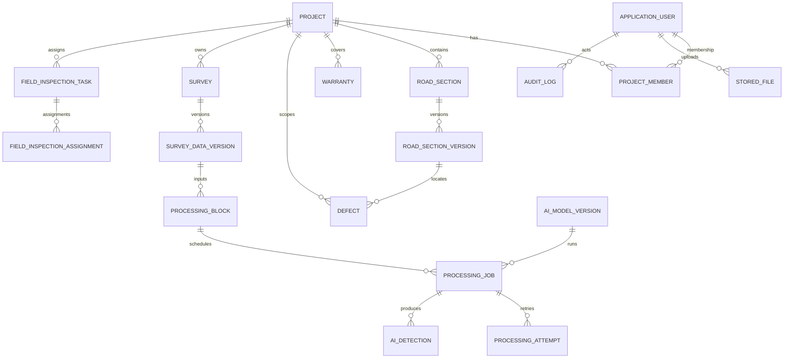

# RoadGuard V2 logical ERD

**Status:** `TARGET_DOCUMENTED` with `CURRENT_VERIFIED` anchors and `PROPOSED_DELTA`; logical design only. This file is not a deployed schema, EF snapshot, migration or runtime contract.

## Authority and status rules

- Business decisions: `planning/V2/V2-3_DECISION_REGISTER.md` D01-D28 and 32-44.
- Logical data authority: V2 Data Dictionary, especially DD-C01..20 and §§3/9.
- Current runtime evidence: `RoadGuardSystem.Repositories/RoadGuardDbContext.cs`, entity classes, configurations and migrations read on 2026-09-28.
- A target relationship is not a physical FK until an approved implementation task maps it to an entity/configuration/migration. No migration is created by this document.

## Current verified persistence backbone

The diagram represents concepts verified from `DbSet<>` and matching BusinessObjects/configuration files. `Report`, `IncidentCase`, `DefectObservation`, `RepairItem`, `RepairAttempt`, `ProcessingInputManifest`, `ReportDefectLink`, `CuringRecord`, `TrafficReleaseRecord`, `SyncOperation` and policy framework entities are not claimed here as current EF entities merely because the DD describes them.

## Target V2 modules

| Target concept | Intended relation | Status | Current evidence / delta |
|---|---|---|---|
| Account/session/membership | User -> sessions/tokens/ProjectMember | `CURRENT_VERIFIED` | `ApplicationUser`, `UserSession`, `RefreshToken`, `ProjectMember` DbSets/configs. |
| Project/route/version/warranty | Project -> RoadSection -> immutable versions; Project -> Warranty/Handover | `CURRENT_VERIFIED` | `Project`, `RoadSection`, `RoadSectionVersion`, `Warranty`, `HandoverDocument` and migrations exist. Current model needs target segment/branch/slab expansion. |
| Report/Case/Defect | Report -> Case -> many Defect; ReportDefectLink preserves reporter projection | `TARGET_DOCUMENTED` / `PROPOSED_DELTA` | `Defect` exists; Report/Case/ReportDefectLink current DbSets were not found. Do not infer publication/reporter isolation from Defect alone. |
| Survey/data/QC | Survey -> Flight/File/DataVersion -> QualityCheck | `CURRENT_VERIFIED` | Survey family, assignments, files, data versions and QC have DbSets/configs/migrations. D15 still requires separate aircraft position, quality and coverage semantics. |
| Inspection/policy snapshot | Policy framework/profile -> project config -> immutable task snapshot -> assignment/session/measurement | `PROPOSED_DELTA` | `FieldInspectionTask/Assignment/Session` and `GroundTruthMeasurement` exist; company framework/profile/snapshot/evaluator entities are absent from current DbSet inventory. |
| Repair/evidence | Defect -> RepairItem -> RepairAttempt -> Evidence/BEFORE/AFTER; curing/release separate | `TARGET_DOCUMENTED` / `PROPOSED_DELTA` | Current DbSet inventory does not contain RepairItem/Attempt or Curing/TrafficRelease entities. No runtime claim. |
| AI processing | DataVersion -> Block -> Job -> Attempt -> immutable manifest/artifact/event receipt -> detection/candidate | `PARTIAL` | Block/Job/Attempt/Model/Detection current; manifest/artifact/event receipt/candidate snapshot target only. D12/D13/33A require two-stage PM-triggered flow. |
| Offline/dedup/audit | client operation -> durable receipt/outcome; actor/snapshot/assignment preserved | `PARTIAL` | `IdempotencyRecord`, `ConsumerEffectReceipt`, `AuditLog`, `OutboxMessage` current; full SyncOperation/phase evaluation/handover/rescue target remains contract delta. |
| Retention/legal hold | evidence/export/ledger -> hold/reference-aware deletion request | `PROPOSED_DELTA` | StoredFile retention fields and audit exist; legal hold/deletion workflow target only. 41A with unknown warranty end remains `WAITING_RETENTION_BASIS`. |

## Constraints and invariants to preserve

1. Route/segment evidence is versioned; changing a used route creates a new version and does not rewrite historical evidence.
2. `SurveyDataVersion` is the dataset anchor for processing/QC; `SERVER_CONFIRMED` is distinct from client precheck.
3. AI detection is a candidate/provenance record, not PM confirmation, Defect verification, repair authorization or acceptance.
4. Batch inspection remains `MEASURE_ONLY`; a repair task after measurement is a new authorization and must retain source measurement/snapshot.
5. Report ownership/public projection is separate from project membership; no ReportDefectLink may expose another reporter's source.
6. Repair physical completion, curing/traffic release and acceptance are separate records/states.
7. Idempotency/receipt replay is actor/project/operation scoped; mismatched payload conflicts and unknown commit outcomes are not safe new operations.
8. Retention execution rechecks legal hold and references; no guessed TTL or deletion date.

## Explicit non-actions

No entity rename, enum renumbering, migration, schema application, seed change or database update is part of DOC-V2-MODEL. Implementation tasks must map each target delta to a real entity/configuration/migration and SQL evidence before changing persistence.
