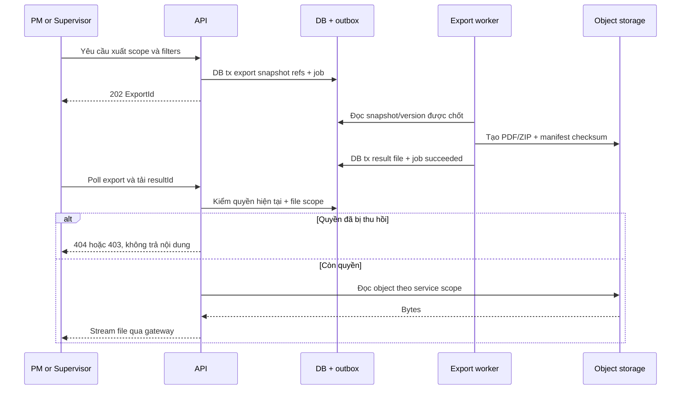

# RoadGuard — 6. Sequence Diagram và Transaction Boundaries

**Phiên bản:** TECH-R3-2026-09-26-v1 • **Trạng thái:** thiết kế đề xuất dựa trên bộ RoadGuard R3. Chưa có repository, ERD hiện hành, OpenAPI thực tế hoặc môi trường chạy để đối chiếu. Không khẳng định endpoint/code/transaction dưới đây đã được triển khai.

**Ưu tiên nguồn:** quyết định CHỐT/KẾ THỪA trong bộ tài liệu R3 giữ nguyên; chi tiết kỹ thuật mới cần P1/P2/FE/AI review. Q01–Q18 giữ mở theo Mô tả dự án §21. Không tự sửa enum số, chuyển DB, nâng framework hoặc đổi trạng thái Done từ các bản thiết kế này.

## 6.1 Ranh giới transaction

Sequence là thiết kế tương tác service, không phải BPMN và chưa chạy. Tối đa năm participant mỗi hình. “DB tx” là transaction SQL Server cho thay đổi nội bộ; external storage/AI/email không rollback cùng DB. Outbox sau commit được retry với event ID; trạng thái notification gửi thành công không là điều kiện mới cho quyền sửa/đóng FT.

## SQ-01 — Fast Track offline → sync → PM review

Trace FR-15/18/21/22/23; TC-F18/22/23; Q04/Q06/Q17.

```mermaid
sequenceDiagram
  participant C as Crew app
  participant L as Local store
  participant A as API
  participant D as DB + outbox
  participant P as PM
  C->>A: Tải task snapshot và policy
  A-->>C: Phạm vi, version, evidence references
  C->>L: Lưu task, policy và bytes đã kiểm
  Note over C,L: Offline; quyền task không tự hết theo thời gian
  C->>L: Ghi số đo, BEFORE, evaluation
  C->>L: Sửa đúng quyền, AFTER, queue
  Note over C,A: Có mạng và session hợp lệ; upload file trước
  C->>A: Sync operation ID + snapshot + file IDs
  A->>D: Kiểm current scope/version và dedup
  alt Snapshot xung đột
    A-->>C: CONFLICT, giữ dữ liệu local
  else Đủ điều kiện nhận
    A->>D: DB tx evidence refs + result + audit + dedup
    D-->>A: Commit
    A-->>C: APPLIED + resource ID/version
  end
  P->>A: Review ACCEPT theo version
  A->>D: DB tx review + FT close + audit + outbox
  D-->>A: Commit
  A-->>P: Đã đóng FT; event báo Supervisor chờ gửi
```

Không gọi API trước mỗi lần bắt đầu sửa khi offline. Lỗi trước commit rollback metadata; local queue giữ. Mất response sau commit: retry cùng operation ID trả kết quả cũ. PM review thiếu file VERIFIED không commit accept. Gửi thông báo Supervisor lỗi chỉ retry outbox, không đảo quyết định PM đã đóng. Nếu đã sửa mà BEFORE hỏng thì lưu ngoại lệ, không tự tạo ảnh thay thế Q06.

## SQ-02 — Duyệt từng item, concurrency và phân công

Trace FR-19/20; TC-F19/20; UAT-03.

```mermaid
sequenceDiagram
  participant P as PM
  participant A as API
  participant D as DB + outbox
  participant S as Supervisor
  participant C as Crew
  P->>A: Submit package với If-Match
  A->>D: DB tx khóa snapshot + audit
  D-->>A: Commit
  A-->>P: SUBMITTED + version
  S->>A: Quyết định item A/B/C theo từng version
  A->>D: Kiểm scope/state/version
  alt Stale version hoặc dữ liệu không hợp lệ
    A-->>S: 412 hoặc 422; không đổi item
  else Hợp lệ
    A->>D: DB tx item decision + audit + outbox
    D-->>A: Commit
    A-->>S: Quyết định từng item
  end
  P->>A: Giao A đã APPROVED
  A->>D: DB tx assignment + lịch sử + notify
  A-->>P: Đã giao
  C->>A: Nhận task được giao
  A-->>C: Snapshot phạm vi A
  Note over P,S: B trình lại bản mới; C bị reject vẫn giữ Defect mở
```

Không transaction toàn gói khiến item A chờ B/C. API v1 dùng request từng item; nếu sau này bulk phải xác định partial semantics. Thay scope/phương án cần version mới/phần duyệt lại, không ghi đè snapshot đã duyệt. Thay đội đang offline Q04 không được báo đã thu hồi thành công khi máy chưa nhận.

## SQ-03 — Upload staging và xác nhận toàn vẹn

Trace FR-21/27; NFR-05; TC-N05.

```mermaid
sequenceDiagram
  participant C as Client
  participant A as API
  participant D as DB
  participant O as Object storage
  participant W as Verify worker
  C->>A: Tạo upload session theo scope
  A->>D: DB tx session + expected hash
  A-->>C: Session và part plan
  C->>A: Xin part URLs
  A-->>C: URL PUT có hạn
  C->>O: PUT các part có retry
  C->>A: Complete và part metadata
  A->>D: DB tx VERIFYING + job/outbox
  A-->>C: 202 VERIFYING
  W->>O: Đọc/check bytes, MIME, checksum
  alt Thiếu/hỏng
    W->>D: Ghi FAILED; giữ trace
  else Toàn vẹn
    W->>D: DB tx VERIFIED + file reference
  end
  C->>A: Poll session
  A-->>C: VERIFIED hoặc lỗi có mã
```

Không giữ transaction trong lúc tải video. URL hết hạn cấp lại sau kiểm quyền, không tạo file nguồn khác. Staging orphan có cleanup job riêng sau grace period được chốt, không xóa bản referenced/pending chưa an toàn. DB commit thất bại sau object đã có: object vẫn staging, worker retry finalize cùng key; không tạo evidence “đã đủ” trước VERIFIED. Hoàn thành multipart không mặc nhiên chứng minh SHA256 toàn tệp.

## SQ-04 — AI job, callback và late result

Trace FR-29/31; NFR-02/10; TC-F29/31.

```mermaid
sequenceDiagram
  participant P as PM client
  participant A as API
  participant D as DB + outbox
  participant W as Worker
  participant I as AI service
  P->>A: Tạo job với Idempotency-Key
  A->>D: DB tx manifest + job + dispatch event
  D-->>A: Commit
  A-->>P: 202 JobId
  W->>D: Claim lease và attempt ID
  W->>I: Manifest, model và attempt identity
  I-->>A: Callback result + hash + service auth
  A->>D: Kiểm job/attempt + dedup
  alt Sai schema/hash/scope
    A-->>I: 422 hoặc 403; không publish
  else Attempt cũ
    A->>D: Lưu nguồn muộn, không ghi đè current
    A-->>I: 200 ghi nhận theo trạng thái job
  else Kết quả hiện hành
    A->>D: DB tx result refs + detections + job + outbox
    A-->>I: 200
  end
  P->>A: Poll job
  A-->>P: Kết quả có version, mock hoặc real
```

Worker không xóa manifest khi thất bại; lease có hạn/heartbeat, retry backoff có giới hạn cấu hình. Hai worker có thể xử lý nhưng unique/dedup chỉ cho một tác động nghiệp vụ. Result raw được lưu/kiểm ngoài DB tx trước attach; rollback transaction không rollback AI inference, retry attach an toàn. No detections vẫn cần PM/coverage review.

## SQ-05 — Dashboard/export snapshot và quyền tải

Trace FR-34/35; RPT-AC-06/08; UAT-09.



Export sử dụng dataset snapshot hoặc immutable references thật; một timestamp đơn độc không đảm bảo snapshot nếu DB không lưu version/history. Nếu chưa tái dựng được as-of phải báo giới hạn và khóa nguồn phù hợp trước generate, không gắn nhãn “snapshot” giả. Lỗi tạo file chỉ fail job, không mất dữ liệu nguồn.

## SQ-06 — Thu hồi phiên và cập nhật quyền

Trace FR-01/36; NFR-01; UAT-11.

```mermaid
sequenceDiagram
  participant S as Supervisor
  participant A as API
  participant D as DB + outbox
  participant C as Online client
  participant L as Offline client
  S->>A: Suspend hoặc đổi role
  A->>D: DB tx account + security version + revoke sessions + audit
  D-->>A: Commit
  A-->>S: Cập nhật xong phía server
  C->>A: Request với token cũ
  A->>D: Kiểm current security state
  A-->>C: 401 hoặc 403
  Note over L: Chưa nhận lệnh khi mất mạng; không xóa evidence
  L->>A: Reconnect, sync snapshot cũ
  A-->>L: Auth required hoặc conflict theo state
  Note over S,L: Q04 và Q17 xử lý bàn giao có kiểm soát
```

## 6.2 Ma trận lỗi, rollback và phục hồi

| Điểm lỗi | Rollback được gì | Phục hồi |
|---|---|---|
| Validate/quyền trước transaction | Không có mutation | Trả lỗi chuẩn; client sửa điều kiện |
| DB transaction trước commit | Toàn bộ aggregate/audit/outbox/idempotency cùng transaction | Retry nếu transient bằng cùng key; không gửi external trước commit |
| DB commit xong nhưng response mất | Không rollback commit | Key/operation ID trả lại đúng kết quả |
| Email/notification provider down | Không đảo quyết định nghiệp vụ | Outbox retry/dedup; alert exhausted |
| Storage đã nhận bytes, metadata chưa commit | Object staging chưa liên kết | Verify/finalize retry; cleanup orphan sau policy |
| AI worker chết/lease hết | Không mất job/manifest | Attempt mới; result cũ giữ nguồn, không ghi đè |
| Thu hồi quyền khi offline | Không thể rollback công việc vật lý đã làm | Giữ snapshot/evidence; review conflict, không tạo quyền server giả |
| Xóa tệp approved nhưng hold xuất hiện | Chặn trước effect; không coi approve là execute | Recheck hold trong serialization/lock quyết định delete, fail BLOCKED; object version/backup theo retention |

Để tránh race hold-vs-delete, job và API hold phải dùng cùng khóa/transaction trạng thái deletion gate; chỉ authorization cấp deletion lease khi không hold. Chính sách khả năng phục hồi object sau effect cần Ops/P2 chốt; không hứa rollback physical delete bằng SQL rollback. Không có sequence thanh toán vì thanh toán không thuộc scope RoadGuard.
