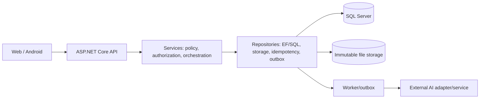

# V2 component and layer boundary

Current project references and source boundaries were checked against ADR 001/004/006. Controllers bind HTTP and map errors; Services own business policy and DTO mapping; Repositories own persistence facts/durability. AI/Web/Android are external workstreams under D44; BE owns adapter/contract/fixtures/integration, not model training or FE implementation.

This diagram is logical and does not claim a deployed worker, provider, host, broker or frontend repository. No package, project reference or runtime configuration is changed by DOC-V2-MODEL.
