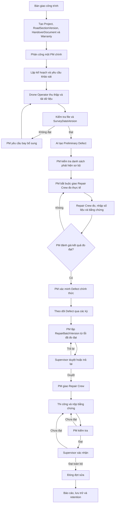

# Mô tả chi tiết các luồng nghiệp vụ RoadGuard / CÁT TƯỜNG

Phiên bản: 14/09/2026  
Phạm vi: MVP sản phẩm, luồng phát triển sau và Research Validation Track.

## 1. Mục đích và tài liệu chuẩn

Tài liệu này mô tả các luồng nghiệp vụ end-to-end của RoadGuard để dùng chung cho phân tích, thiết kế API, thiết kế giao diện, lập trình và kiểm thử.

Thứ tự ưu tiên khi có khác biệt:

1. `Build/RoadGuard_Data_Dictionary_v1.md` là chuẩn về entity, field, quan hệ, kiểu dữ liệu, trạng thái và công nghệ.
2. `UseCase/Dac_ta_UseCase.md` là chuẩn về tác nhân, hành vi và quy tắc nghiệp vụ.
3. `User_Stories_Acceptance_Criteria.md` là chuẩn về kết quả người dùng và tiêu chí nghiệm thu.
4. `RoadGuard_Contractor_Warranty_Inspection_phuonglhk.md` là đề cương và phạm vi nghiên cứu.

Kiến trúc áp dụng: Backend C# / ASP.NET Core / EF Core, SQL Server + SQL Server Spatial, ứng dụng Android cho Drone Operator và Repair Crew, Web Dashboard cho Supervisor và PM, AI Service viết bằng Python. GPS dùng `geography(4326)`; hình học kỹ thuật dùng UTM `32648` hoặc `32649` theo cấu hình dự án.

## 2. Tác nhân và phạm vi quyền

| Tác nhân | Phạm vi chính |
|---|---|
| Supervisor, đồng thời có quyền Admin | Tạo dự án, quản lý đoạn đường và bảo hành, phân công PM, duyệt đợt sửa, xác nhận hoàn tất, quản trị hệ thống, phê duyệt xóa dữ liệu. |
| PM, Project Manager | Quản lý dự án được giao, lập khảo sát, điều phối Drone Operator, rà soát phát hiện AI sơ bộ, bắt buộc giao đo thực tế, đánh giá số đo và xác minh hư hỏng chính thức, lập đợt sửa, giao Repair Crew thi công, kiểm tra kết quả. |
| Drone Operator | Nhận nhiệm vụ khảo sát, thực hiện chuyến bay, nhập video/SRT, kiểm tra và đồng bộ dữ liệu. |
| Repair Crew | Đội trưởng nhận nhiệm vụ đo thực tế hoặc đợt sửa, ghi số đo, tiến độ, chi phí và bằng chứng tại hiện trường. |
| Backend/System Worker | Kiểm tra toàn vẹn, kiểm tra chất lượng, chia khối, điều phối AI, gửi thông báo, tạo báo cáo và chạy retention job. |
| AI Service | Xử lý dữ liệu khảo sát và trả phát hiện AI; không có quyền quyết định lỗi chính thức hoặc trách nhiệm bảo hành. |

Mọi API phải kiểm tra cả vai trò và phạm vi `ProjectMember`. Supervisor xem toàn bộ; các vai trò còn lại chỉ xem dự án hoặc công việc được phân công. Một dự án có tối đa một PM chính đang hiệu lực tại một thời điểm.

## 3. Bức tranh tổng thể

## 4. Các nguyên tắc xuyên suốt

1. Không xóa cứng lịch sử nghiệp vụ chỉ vì đối tượng ngừng sử dụng, bị từ chối hoặc bị thay thế.
2. Nội dung đã trình, xác nhận hoặc công bố không được cập nhật tại chỗ; phải tạo version hoặc bản ghi mới.
3. `Warranty` là aggregate độc lập, không gộp thời hạn bảo hành vào `HandoverDocument`.
4. `SupplementarySurveyRequest` là aggregate độc lập; mỗi lượt có `round_no`, lý do và phạm vi riêng.
5. `QualityCheck` phải trỏ đúng một đích: `SurveyFile` hoặc `SurveyDataVersion`.
6. `Evidence` phải trỏ đúng một đích nghiệp vụ: `Defect`, `RepairItem` hoặc `HandoverDocument`.
7. File gốc và phát hiện AI thô là bất biến. Thay đổi tạo bản ghi hoặc version mới.
8. Nhật ký là append-only và không lưu password, token, secret, cookie hoặc request body nhạy cảm.
9. Dọn bản sao cục bộ trên điện thoại không phải là xóa dữ liệu máy chủ.
10. AI, số đo thực tế và kết quả nghiên cứu chỉ cung cấp căn cứ.
11. Mọi phát hiện AI được PM giữ lại để xử lý là `Preliminary Defect`, ánh xạ kỹ thuật bằng `Defect.status = OPEN`. PM bắt buộc giao Repair Crew đo đạc thực tế; chỉ sau khi PM chấp nhận số đo và bằng chứng, lỗi mới chuyển `VERIFIED` và đủ điều kiện đưa vào đợt sửa chữa.

## 5. Luồng 01 - Đăng nhập, phiên làm việc, hồ sơ và thông báo

**Mục tiêu:** Cho người dùng nội bộ truy cập đúng vai trò và đúng phạm vi dự án.

**Điều kiện đầu vào:** Có `User` ở trạng thái `ACTIVE`; tài khoản có `role_code` hợp lệ.

**Luồng chính:**

1. Người dùng nhập thông tin đăng nhập.
2. Backend xác thực bằng cơ chế chuẩn của ASP.NET Core; không trả `password_hash` ra API.
3. Backend tạo `Session` và `RefreshToken`; chỉ hash của refresh token được lưu.
4. Hệ thống tải quyền vai trò và các `ProjectMember` đang hiệu lực.
5. Người dùng xem dự án, công việc, thông báo trong đúng phạm vi.
6. Người dùng có thể cập nhật hồ sơ cá nhân nhưng không tự đổi vai trò hoặc quyền dự án.
7. Khi đăng xuất, hết hạn, reset mật khẩu hoặc suspend tài khoản, phiên và refresh token bị thu hồi.

**Nhánh ngoại lệ:**

- `SUSPENDED` hoặc `PENDING`: từ chối đăng nhập.
- `must_change_password = true`: chỉ cho đi qua luồng đổi mật khẩu trước khi dùng chức năng khác.
- Truy cập dự án ngoài phạm vi: trả lỗi quyền, không làm lộ sự tồn tại hoặc nội dung dự án.
- Phiên hết hạn: yêu cầu xác thực lại; bản nháp cục bộ không tự mất.

**Dữ liệu và audit:** `User`, `Role`, `Session`, `RefreshToken`, `ProjectMember`, `Notification`, `AuditLog`.

**Kết quả:** Người dùng có phiên hợp lệ và chỉ thấy dữ liệu được phép.

## 6. Luồng 02 - Yêu cầu và đặt lại mật khẩu

**Mục tiêu:** Khôi phục quyền truy cập mà không làm lộ mật khẩu hoặc token.

**Luồng chính:**

1. Người dùng gửi yêu cầu khôi phục.
2. Supervisor/Admin kiểm tra danh tính và trạng thái tài khoản.
3. Nếu hợp lệ, Admin đặt mật khẩu tạm hoặc kích hoạt cơ chế reset được phê duyệt.
4. Backend đặt `must_change_password = true`, thu hồi toàn bộ `Session` và `RefreshToken` hiện tại.
5. Hệ thống thêm `PasswordResetLog` với người thực hiện, thời điểm, lý do, kết quả, nguồn và `correlation_id`.
6. Lần đăng nhập tiếp theo bắt buộc đổi mật khẩu.

**Nhánh ngoại lệ:** Tài khoản `SUSPENDED` bị từ chối reset; yêu cầu sai hoặc hết hạn ghi kết quả `FAILED`/`REJECTED` nhưng không ghi token hay mật khẩu.

**Kết quả:** Mật khẩu được thay an toàn, mọi phiên cũ mất hiệu lực và có log riêng để kiểm tra.

## 7. Luồng 03 - Làm việc ngoại tuyến và đồng bộ an toàn

**Mục tiêu:** Drone Operator và Repair Crew tiếp tục làm việc khi mất mạng mà không mất dữ liệu.

**Luồng chính:**

1. Khi có mạng, người dùng tải trước nhiệm vụ, bản đồ và dữ liệu tham chiếu trong phạm vi quyền.
2. Khi ngoại tuyến, ứng dụng lưu video đã sao chép, số đo, tiến độ, ảnh và bản nháp trong bộ nhớ ứng dụng.
3. Mỗi mục hiển thị rõ `chưa đồng bộ`, `chờ tải`, `đang tải`, `máy chủ đã xác nhận` hoặc `không hợp lệ`.
4. Khi có mạng và ứng dụng được mở lại, hàng đợi tiếp tục theo cơ chế retry/idempotency.
5. Backend nhận đủ dữ liệu, kiểm tra kích thước, MIME, checksum và quan hệ nguồn.
6. Chỉ sau khi server xác nhận toàn vẹn, ứng dụng mới hiển thị đã đồng bộ.
7. Người dùng chủ động chọn dọn bản sao cục bộ đã xác nhận.

**Nhánh ngoại lệ:**

- Mất mạng giữa chừng: tiếp tục từ phần chưa hoàn tất, không tạo trùng bản ghi.
- Checksum sai hoặc thiếu chunk: giữ bản cục bộ, đánh dấu lỗi và tải lại.
- Tài khoản bị suspend trước lúc đồng bộ: chặn đồng bộ; không tự chuyển bản nháp cho người khác.
- Không đủ bộ nhớ: cảnh báo trước khi sao chép, không báo nhập thành công.

**Kết quả:** Dữ liệu trên máy chủ đầy đủ, có kiểm tra toàn vẹn; dữ liệu chưa xác nhận vẫn còn trên thiết bị.

## 8. Luồng 04 - Khởi tạo dự án, đoạn đường, bàn giao và bảo hành

**Mục tiêu:** Tạo nền dữ liệu chính xác trước khi khảo sát.

**Tác nhân:** Supervisor.

**Luồng chính:**

1. Supervisor tạo `Project` với `project_code` duy nhất và trạng thái `PLANNING` hoặc `ACTIVE`.
2. Tạo các `RoadSection` thuộc dự án.
3. Với mỗi đoạn, tạo `RoadSectionVersion` đầu tiên gồm hình học, `version_no`, thời điểm hiệu lực và lý do.
4. Tạo `HandoverDocument`, ghi số hồ sơ, ngày bàn giao và liên kết tệp gốc nếu có.
5. Tạo một hoặc nhiều `Warranty` độc lập theo phạm vi dự án, đoạn đường, hạng mục hợp đồng hoặc phạm vi khác.
6. Kiểm tra `warranty_end_date >= warranty_start_date`; ghi giá trị giữ lại bằng VND và tài liệu nguồn.
7. Phân công đúng một PM chính bằng `ProjectMember`; bổ sung Drone Operator/Repair Crew khi cần.
8. Chuyển dự án sang `ACTIVE` khi dữ liệu nền tối thiểu đã đủ.

**Thay đổi đoạn đường:** Khi đoạn đã có khảo sát, lỗi hoặc sửa chữa, mọi thay đổi hình học/lý trình phải tạo `RoadSectionVersion` mới. Dữ liệu lịch sử vẫn trỏ vào version cũ và không tự động chuyển sang version mới.

**Nhánh ngoại lệ:** Trùng mã dự án/đoạn, nhiều PM chính cùng hiệu lực, hình học không hợp lệ hoặc thời hạn bảo hành ngược bị chặn.

**Kết quả:** Dự án có cấu trúc đường, hồ sơ bàn giao, bảo hành và nhân sự rõ ràng.

## 9. Luồng 05 - Lập kế hoạch khảo sát và nhắc việc

**Mục tiêu:** Bảo đảm khảo sát gốc và các kỳ khảo sát diễn ra đúng thời điểm.

**Tác nhân:** PM; Admin cấu hình quy tắc nhắc.

**Luồng chính:**

1. PM chọn dự án và `RoadSection` đang hoạt động.
2. Tạo `SurveyPlan` với loại `ORIGINAL`, `PERIODIC` hoặc `SUPPLEMENTARY`, thời gian dự kiến và phạm vi.
3. Hệ thống áp dụng `ReminderRule` để gửi nhắc trước ngày khảo sát hoặc trước hạn bảo hành.
4. PM có thể tạo `SurveyRequest` từ kế hoạch hoặc tạo yêu cầu phát sinh độc lập.
5. Nếu cần hoãn, PM ghi `SurveyPlanPostponement` với lý do và ngày mới nếu đã biết.
6. Kế hoạch chuyển qua `PLANNED`, `POSTPONED`, `IN_PROGRESS`, `COMPLETED` hoặc `CANCELLED` theo hành vi thực tế.

**Quy tắc:** Nhắc việc không tự tạo lệnh bay; hoãn kế hoạch khác với hủy một `SurveyRequest` đã tạo.

**Kết quả:** Có lịch khảo sát truy vết được, gồm baseline ngay sau bàn giao và các kỳ tiếp theo.

## 10. Luồng 06 - Tạo, phân công, tiếp nhận hoặc từ chối yêu cầu khảo sát

**Mục tiêu:** Giao đúng một Drone Operator thực hiện yêu cầu khảo sát hợp lệ.

**Luồng chính:**

1. PM tạo `SurveyRequest`, chọn dự án, đoạn đường, loại khảo sát, thời hạn, phạm vi và đầu ra cần có.
2. PM tạo `SurveyAssignment` cho một Drone Operator.
3. Yêu cầu chuyển `NEW_ASSIGNED`; hệ thống gửi `Notification`.
4. Drone Operator xem phạm vi, lịch, hướng dẫn và xác nhận nhận việc.
5. `accepted_at` được ghi; yêu cầu chuyển `ACCEPTED` rồi `IN_PROGRESS` khi bắt đầu.

**Từ chối trước khi nhận:**

1. Drone Operator nhập lý do bắt buộc.
2. `SurveyAssignment.rejected_at` và `rejection_reason` được ghi.
3. PM nhận thông báo và phân công lại.
4. Lần phân công cũ có `ended_at`; lần mới giữ `reassignment_reason` và lịch sử đầy đủ.

**Quy tắc:** Sau khi đã nhận, Drone Operator không tự từ chối hoặc hủy; PM phải điều chỉnh phân công.

**Kết quả:** Yêu cầu có người chịu trách nhiệm rõ ràng hoặc quay lại PM để giao lại.

## 11. Luồng 07 - Hủy hoặc thu hồi yêu cầu khảo sát

**Mục tiêu:** Cho PM hủy yêu cầu chưa tạo dữ liệu máy chủ hợp lệ mà không gây mất hồ sơ.

**Luồng chính:**

1. PM mở yêu cầu và nhập lý do hủy.
2. Backend khóa logic yêu cầu hoặc dùng concurrency token để thực hiện kiểm tra và cập nhật nguyên tử.
3. Backend kiểm tra không tồn tại `SurveyDataVersion` của survey liên quan ở trạng thái `SERVER_CONFIRMED` với `integrity_status = PASSED`.
4. Nếu đạt điều kiện, cập nhật `SurveyRequest.status = CANCELLED`, `cancelled_at` và `cancellation_reason`.
5. Thông báo cho Drone Operator nếu yêu cầu đã được giao hoặc đã nhận.
6. Giữ toàn bộ lịch sử, không xóa cứng assignment hoặc bản nháp.

**Nhánh tranh chấp đồng thời:** Nếu checksum được xác nhận trong lúc PM bấm hủy, chỉ một giao dịch được thắng. Backend phải tái kiểm tra ngay trước commit; nếu data version đã `SERVER_CONFIRMED`, từ chối hủy và hướng PM sang phân công lại hoặc yêu cầu bổ sung.

**Kết quả:** Yêu cầu chỉ bị hủy khi chưa có bộ dữ liệu toàn vẹn trên máy chủ.

## 12. Luồng 08 - Thu thập chuyến bay, nhập video/SRT và tải dữ liệu

**Mục tiêu:** Đưa dữ liệu khảo sát từ thiết bị vào đúng `Survey` với nguồn gốc đầy đủ.

**Luồng chính:**

1. Drone Operator tạo hoặc cập nhật `Flight`, chọn drone, số chuyến, thời gian và phạm vi đã bay.
2. Ứng dụng sao chép thật video từ thẻ nhớ vào bộ nhớ ứng dụng và kiểm tra bản sao.
3. Tạo metadata `File` và `SurveyFile`; gắn đúng `Survey` và `Flight`.
4. Nếu video chứa phụ đề định vị có thể trích xuất, ứng dụng đọc và kiểm tra đồng bộ thời gian.
5. Nếu thiếu, người dùng chọn SRT tương ứng; hệ thống kiểm tra quan hệ video/SRT và khoảng thời gian.
6. Ứng dụng kiểm tra sơ bộ định dạng, định vị, độ rõ, ánh sáng, vùng phủ và độ chồng lấn.
7. Các tệp được xếp hàng và tải lên; server kiểm tra MIME thực, malware, kích thước và SHA-256.
8. `SurveyFile.sync_status` chỉ thành `SERVER_CONFIRMED` sau khi file toàn vẹn.
9. Backend tạo `SurveyDataVersion` và `source_manifest` liệt kê các file/checksum thuộc version.
10. Khi đủ file và mọi checksum hợp lệ, đặt version thành `SERVER_CONFIRMED`, `integrity_status = PASSED` và ghi `confirmed_at`.

**Nhánh ngoại lệ:** File sai định dạng, thiếu GPS, lệch thời gian hoặc checksum sai tạo kết quả kiểm tra cụ thể; dữ liệu nguồn không bị ghi đè.

**Kết quả:** Có một phiên bản dữ liệu khảo sát toàn vẹn, bất biến và đủ điều kiện kiểm tra dataset/xử lý.

## 13. Luồng 09 - Kiểm tra chất lượng hai cấp

**Mục tiêu:** Phân biệt lỗi từng file với lỗi toàn bộ dataset.

**Luồng cấp file:**

1. Với từng `SurveyFile`, hệ thống tạo các `QualityCheck` có `scope = SURVEY_FILE`.
2. `survey_file_id` bắt buộc có giá trị; `survey_data_version_id` bắt buộc null.
3. Kiểm tra format, geolocation, time sync, clarity, lighting và các tiêu chí áp dụng.
4. Kết quả là `PENDING`, `PASSED`, `FAILED` hoặc `WARNING`, kèm message và giá trị đo.

**Luồng cấp dataset:**

1. Khi có `SurveyDataVersion`, tạo các `QualityCheck` có `scope = SURVEY_DATASET`.
2. `survey_data_version_id` bắt buộc có giá trị; `survey_file_id` bắt buộc null.
3. Kiểm tra coverage, overlap, completeness và tính nhất quán giữa các file.
4. Tổng hợp vùng thiếu hoặc không đạt để PM quyết định.

**Quy tắc dữ liệu:** Database phải enforce XOR hai FK. Các JSON `measured_value` và `threshold` phải qua `ISJSON` và schema ứng dụng.

**Kết quả:** PM biết chính xác lỗi thuộc file nào hay toàn bộ dataset và có căn cứ cho bay bổ sung.

## 14. Luồng 10 - Bay bổ sung và tạo phiên bản dữ liệu mới

**Mục tiêu:** Bổ sung vùng không đạt mà không làm mất dữ liệu cũ.

**Luồng chính:**

1. PM xem `QualityCheck` và xác nhận cần bổ sung.
2. Tạo `SupplementarySurveyRequest` độc lập, liên kết `Survey`, lý do, `requested_scope` và `round_no` tăng dần.
3. PM phê duyệt/phân công Drone Operator; có thể chọn người khác lượt trước.
4. Drone Operator thực hiện chuyến bay và nộp dữ liệu bổ sung theo Luồng 08.
5. Backend giữ nguyên file/version cũ, tạo file mới và `SurveyDataVersion` mới.
6. Kiểm tra chất lượng lại trên version mới.
7. Nếu vẫn thiếu, PM tạo lượt bổ sung tiếp theo; không giới hạn số lượt nhưng mỗi lượt phải có lý do và phạm vi.

**Nhánh ngoại lệ:** Lượt bổ sung bị từ chối hoặc hủy giữ nguyên dữ liệu các lượt trước. Không update-in-place `source_manifest` của version đã xác nhận.

**Kết quả:** Dữ liệu hoàn thiện dần nhưng toàn bộ nguồn gốc từng lượt vẫn truy vết được.

## 15. Luồng 11 - Xử lý AI, retry và lưu phát hiện thô

**Mục tiêu:** Chạy AI có kiểm soát trên đúng phiên bản dữ liệu.

**Điều kiện:** `SurveyDataVersion.status = SERVER_CONFIRMED`, toàn vẹn đạt và kiểm tra chất lượng đủ điều kiện xử lý.

**Luồng chính:**

1. Backend chia data version thành các `ProcessingBlock` với `block_no` và `range_metadata`.
2. Với mỗi block, tạo `ProcessingJob` trỏ tới `AIModelVersion` đã phát hành.
3. Job chuyển `QUEUED` sang `RUNNING`; mỗi lần chạy tạo `ProcessingAttempt` append-only.
4. AI Service nhận video/metadata và trả loại lỗi dự kiến, confidence, bounding box, vị trí và payload nguồn.
5. Backend lưu `AIDetection` bất biến, liên kết job, model và `RoadSectionVersion` khi định vị được.
6. Job thành `COMPLETED`; PM và Drone Operator xem trạng thái.

**Nhánh lỗi:**

- Lỗi hạ tầng: attempt ghi `error_type = INFRASTRUCTURE`; job thành `RETRYABLE_FAILURE` và có thể thử lại trên dữ liệu cũ.
- Lỗi dữ liệu: attempt ghi `error_type = DATA`; job thành `DATA_FAILURE`; PM quyết định bay bổ sung.
- Hủy job: chuyển `CANCELLED`, không xóa attempt hoặc detection đã tạo.
- Phase 1 có thể dùng mock AI nhưng phải giữ cùng contract và nguồn gốc.

**Kết quả:** Phát hiện thô có model version và dữ liệu nguồn rõ ràng, sẵn sàng cho PM rà soát sơ bộ.

## 16. Luồng 12 - PM kiểm tra danh sách phát hiện sơ bộ của AI

**Mục tiêu:** Rà soát kết quả AI thành danh sách `Preliminary Defect` cần đo đạc thực tế; về kỹ thuật các mục được giữ lại là `Defect OPEN`, chưa phải `Defect VERIFIED`.

**Luồng chính:**

1. PM mở detection trên bản đồ, ảnh/video, xem loại dự kiến, confidence, bounding box và dữ liệu nguồn.
2. PM chọn một trong các quyết định sơ bộ: giữ lại để đo thực tế, hiệu chỉnh thông tin dự kiến, loại bỏ hoặc giữ chờ rà soát thêm.
3. Khi giữ lại, hệ thống tạo `Defect` ở trạng thái `OPEN` để biểu diễn `Preliminary Defect`, đúng dự án và `RoadSectionVersion`, giữ liên kết `source_ai_detection_id`; trạng thái này chưa phải xác minh chính thức.
4. Khi hiệu chỉnh, PM sửa loại, mức độ, vị trí/vùng và ghi lý do.
5. Khi loại bỏ, detection vẫn được giữ; `DefectVerificationLog.action = REJECT` ghi lại quyết định.
6. Mọi quyết định ghi `DefectVerificationLog` append-only với before/after snapshot, người, thời điểm, lý do và version quy tắc mức độ.
7. Với phát hiện trùng, hệ thống có thể đề xuất nhưng PM quyết định `MERGE` hoặc `KEEP_SEPARATE`; lưu `DefectMergeDecision`.

**Bước bắt buộc tiếp theo:** Với mọi `Preliminary Defect` được giữ lại, PM phải thực hiện Luồng 14 để giao Repair Crew đo đạc thực tế. Không được xác minh chính thức hoặc đưa thẳng vào đợt sửa chữa khi chưa hoàn tất bước này.

**Kết quả:** Danh sách phát hiện sơ bộ đã được PM rà soát, gồm các mục chờ giao đo, bị loại có lý do hoặc còn chờ rà soát; mọi mục vẫn liên kết với phát hiện AI thô.

## 17. Luồng 13 - Xác nhận baseline và đối chiếu qua các kỳ

**Mục tiêu:** Chọn khảo sát gốc đáng tin cậy làm mốc bảo hành.

**Điều kiện để xác nhận:**

1. `Survey.survey_type = ORIGINAL` và PM có quyền dự án.
2. Có ít nhất một `SurveyDataVersion` được server xác nhận toàn vẹn.
3. Mọi `QualityCheck` bắt buộc của version được chọn đạt hoặc warning đã được xử lý theo quy định.
4. Mọi `ProcessingJob` bắt buộc đã `COMPLETED`; không còn job chạy hoặc lỗi chưa xử lý.
5. Các detection bắt buộc đã được loại bỏ/đánh dấu ngoài phạm vi có lý do, hoặc đã đi qua đo đạc thực tế, được PM chấp nhận kết quả đo và xác minh thành `Defect` chính thức.

**Luồng chính:**

1. Application Service đọc snapshot/version của `Survey`, `SurveyDataVersion`, `QualityCheck`, `ProcessingJob` và `Defect` bằng truy vấn read-only có index.
2. Dịch vụ đánh giá invariant ngoài transaction dài; không khóa toàn bộ bốn aggregate trong lúc người dùng xem.
3. Khi PM bấm xác nhận, transaction ngắn tái kiểm tra ID/version và các điều kiện quyết định.
4. Nếu không có thay đổi đồng thời, đặt `is_baseline_confirmed = true`, ghi người và thời điểm.
5. Các kỳ sau dùng baseline này để đối sánh bằng `DefectMatch`, xem lỗi mới, ổn định hoặc phát triển.

**Kiểm soát đồng thời:** Dùng optimistic concurrency/rowversion hoặc isolation phù hợp; đọc theo thứ tự ổn định và chỉ ghi hàng `Survey`. Nếu dữ liệu nguồn thay đổi trước commit, trả lỗi conflict và yêu cầu PM tải lại thay vì giữ nhiều khóa lâu.

**Kết quả:** Baseline có nguồn dữ liệu, trạng thái xử lý và quyết định xác minh đầy đủ.

## 18. Luồng 14 - Bắt buộc giao Repair Crew đo đạc thực tế

**Mục tiêu:** Thu thập số đo vật lý và bằng chứng hiện trường bắt buộc trước khi PM xác minh một phát hiện sơ bộ thành hư hỏng chính thức.

**Tác nhân:** PM giao việc; Repair Crew thực hiện; PM đánh giá.

**Điểm kích hoạt:** PM giữ lại một phát hiện AI trong danh sách `Preliminary Defect`. Mức độ nghiêm trọng hoặc độ tin cậy AI không làm mất yêu cầu đo đạc bắt buộc.

**Luồng giao và tiếp nhận:**

1. PM chọn dự án, `RoadSectionVersion`, `Survey` và `Preliminary Defect` (`Defect OPEN`) liên quan.
2. PM ghi loại phép đo, vị trí/phạm vi, lý do, thông tin còn thiếu, thời hạn và Repair Crew phụ trách.
3. Repair Crew nhận thông báo, xem vị trí, loại đo, dụng cụ/phương pháp yêu cầu.
4. Đội trưởng chấp nhận; nếu từ chối trước khi nhận phải có lý do và PM giao lại.
5. Sau khi đã nhận, Repair Crew không tự hủy; PM xử lý việc điều chuyển.

**Luồng đo tại hiện trường:**

1. Repair Crew mở nhiệm vụ, có thể làm việc ngoại tuyến.
2. Tạo `FieldInspectionSession` gắn `Project`, `RoadSectionVersion`, `Survey` nếu có, người đo, thời gian, thời tiết và phương pháp.
3. Với mỗi điểm đo, tạo `GroundTruthMeasurement` có `sample_id` duy nhất trong session.
4. Chọn `measurement_type`: `DEPRESSION_DEPTH`, `SLAB_FAULTING_HEIGHT` hoặc `SHOULDER_EROSION_EXTENT`.
5. Ghi `value`, `unit`, dụng cụ, tham chiếu hiệu chuẩn nếu có, phương pháp, người đo và thời điểm.
6. Ghi GPS `geography(4326)` và ảnh/biên bản qua `evidence_file_id`; nếu thiếu bằng chứng phải có ghi chú lý do theo quy trình.
7. Đồng bộ toàn bộ bản ghi và file; chỉ gửi chính thức khi server xác nhận.
8. Session đã gửi/khóa không bị ghi đè; bổ sung bằng bản ghi hoặc session mới.

**Luồng PM đánh giá:**

1. PM kiểm tra đúng đoạn/version, loại đo, đơn vị, vị trí/SRID, dụng cụ, phương pháp, thời gian và bằng chứng.
2. Nếu đạt, đánh dấu nhiệm vụ hoàn tất; PM chuyển `Defect` từ `OPEN` sang `VERIFIED`, ghi log xác minh và bảo đảm các `GroundTruthMeasurement`/bằng chứng đã chấp nhận liên kết đúng lỗi.
3. Nếu thiếu, nêu rõ mẫu hoặc dữ liệu cần bổ sung; Repair Crew tạo phép đo mới, không sửa mất bản cũ.
4. Nếu bằng chứng thực địa cho thấy không có hư hỏng, PM chuyển `Defect` từ `OPEN` sang `REJECTED`, ghi lý do và giữ toàn bộ lịch sử AI/đo đạc.

**Ranh giới bắt buộc:** Kết quả đo không tự tạo/sửa `Defect`, không tự chuyển `Warranty`.

**Lưu ý ánh xạ:** `Preliminary Defect` là tên nghiệp vụ của `Defect OPEN`, không phải entity mới. Data Dictionary chuẩn hóa dữ liệu đo bằng `FieldInspectionSession` và `GroundTruthMeasurement`; phép đo liên kết qua `GroundTruthMeasurement.defect_id`. Hồ sơ giao việc/trạng thái nhiệm vụ là yêu cầu ở lớp Use Case/User Story. Khi thiết kế API/migration phải ánh xạ rõ phần giao việc mà không tự thêm field tùy tiện vào các entity đo.

**Kết quả:** PM có bộ số đo thực tế đạt yêu cầu để xác minh hư hỏng chính thức hoặc loại phát hiện có căn cứ; không còn đường chuyển trực tiếp từ `Preliminary Defect` sang đợt sửa chữa.

## 19. Luồng 15 - Theo dõi cùng một hư hỏng qua nhiều kỳ

**Mục tiêu:** Tránh đếm trùng và đánh giá diễn biến theo thời gian.

**Luồng chính:**

1. Hệ thống so sánh detection/Defect giữa khảo sát hiện tại và baseline hoặc kỳ trước.
2. Tạo đề xuất ghép theo vị trí, loại lỗi, hình học và đặc trưng ảnh.
3. PM xác nhận hoặc sửa ghép; lưu `DefectMatch` với hai defect, confidence, phương pháp và người duyệt.
4. PM xem lịch sử lần đầu xuất hiện, thay đổi severity, hình học, ảnh và số đo.
5. Dashboard phân loại lỗi mới, ổn định hoặc phát triển khi dữ liệu đủ tương thích.
6. Cảnh báo ưu tiên dựa trên severity, tốc độ thay đổi và độ tin cậy, không trình bày như dự báo chắc chắn.

**Nhánh ngoại lệ:** Thiếu baseline, khác SRID/version không thể quy đổi, thiếu vùng phủ hoặc chất lượng kỳ khảo sát không tương thích phải hiển thị `không đủ căn cứ`, không suy diễn tăng trưởng.

**Kết quả:** Diễn biến lỗi có thể truy ngược tới từng khảo sát và quyết định ghép.

## 20. Luồng 16 - Duyệt nhãn và xuất dữ liệu huấn luyện

**Mục tiêu:** Chỉ đưa nhãn đã được PM kiểm tra vào tập huấn luyện.

**Luồng chính:**

1. PM xem nhãn từ detection đã xác minh hoặc dữ liệu đã hiệu chỉnh.
2. PM phê duyệt hoặc từ chối `TrainingLabelApproval`; nhãn giữ payload và liên kết `Defect`.
3. Admin chọn bộ lọc để tạo `TrainingDatasetExport`.
4. Backend chỉ lấy nhãn `APPROVED`, lưu `filter_snapshot`, nguồn file và version dữ liệu/model.
5. Job xuất chuyển `REQUESTED` sang `GENERATING`, rồi `COMPLETED` hoặc `FAILED`.
6. File kết quả được bảo vệ theo quyền và có checksum.

**Kết quả:** Dataset huấn luyện có nguồn gốc, quyền phê duyệt và khả năng tái tạo.

## 21. Luồng 17 - Lập và trình đợt sửa chữa

**Mục tiêu:** Gộp các lỗi đã đo đạc đạt và được PM xác minh chính thức thành một đợt sửa có chi phí dự kiến.

**Điều kiện:** `Defect` ở trạng thái `VERIFIED`, có nhiệm vụ đo đạc thực tế đã hoàn tất, kết quả đo/bằng chứng đã được PM chấp nhận và không thuộc một version đợt sửa đang hoạt động khác.

**Luồng chính:**

1. PM tạo `RepairBatch` cho dự án.
2. Tạo `RepairBatchVersion` số 1 ở trạng thái `DRAFT`.
3. PM chỉ có thể chọn các `Defect` thỏa điều kiện đo đạc đạt; hệ thống tạo `RepairItem` cho từng lỗi.
4. Với từng item, PM chỉ nhập chi phí dự kiến; không nhập biện pháp, vật liệu, khối lượng hoặc mức ưu tiên.
5. Backend kiểm tra điều kiện đo đạc/xác minh và kiểm tra trùng Defect trong cùng version và trong các version đợt đang hoạt động.
6. Backend tính `estimated_total_cost` bằng VND từ snapshot item của version.
7. PM đính kèm bằng chứng, rà soát phạm vi và trình toàn bộ version.
8. Version chuyển `PENDING_APPROVAL`, ghi `submitted_at` và trở thành bất biến.

**Kiểm soát hai người thao tác đồng thời:** Kiểm tra ở EF Core là cần nhưng chưa đủ. Transaction tạo/trình phải khóa hoặc dùng ràng buộc/index phù hợp trên representation của membership đang hoạt động; khi conflict, một giao dịch thành công và giao dịch còn lại nhận lỗi Defect đã thuộc đợt khác.

**Nhánh ngoại lệ:** Defect chưa có kết quả đo được PM chấp nhận thì không xuất hiện trong danh sách chọn hoặc bị chặn khi gửi; thiếu chi phí hoặc bằng chứng bắt buộc thì giữ `DRAFT`; không được phân công thi công.

**Kết quả:** Một phiên bản đợt sửa hoàn chỉnh chờ Supervisor duyệt.

## 22. Luồng 18 - Duyệt, trả lại và trình lại đợt sửa

**Mục tiêu:** Supervisor quyết định trên toàn bộ phiên bản đợt sửa.

**Luồng chính khi duyệt:**

1. Supervisor xem từng `RepairItem`, chi phí dự kiến và tổng dự toán.
2. Với mỗi item, ghi `RepairApprovalDecision`.
3. Chỉ khi toàn bộ phạm vi đạt, version chuyển `APPROVED`, ghi người và thời điểm.
4. `RepairBatch.current_version_id` trỏ vào version đã duyệt hiện hành.

**Luồng trả chỉnh sửa:**

1. Supervisor ghi item chưa đạt và lý do; decision là `REVISION_REQUIRED` hoặc `REJECTED`.
2. Version chuyển `REVISION_REQUIRED`; version cũ vẫn bất biến.
3. PM tạo version mới, copy các item cần thiết rồi chỉnh phần bị trả.
4. Backend tính lại tổng và PM trình lại toàn bộ version mới.
5. Quyết định của version cũ chỉ dùng đối chiếu, không cho phép triển khai version mới chưa duyệt.

**Kết quả:** Đợt được duyệt toàn bộ hoặc quay lại PM với lý do cụ thể và lịch sử đầy đủ.

## 23. Luồng 19 - Phân công và bàn giao Repair Crew

**Mục tiêu:** Giao một version đợt sửa đã duyệt cho đúng đội trưởng.

**Luồng chính:**

1. PM chỉ được chọn `RepairBatchVersion` đang là current và `APPROVED`.
2. Chọn một User vai trò `REPAIR_CREW` có quyền dự án.
3. Tạo `RepairAssignment` với người giao, người nhận và thời điểm.
4. Repair Crew nhận thông báo và xem danh sách lỗi, bản đồ, chi phí đã duyệt và yêu cầu bằng chứng.
5. Đội trưởng chấp nhận trước khi bắt đầu thi công.

**Từ chối:** Chỉ được từ chối trước khi nhận; lý do bắt buộc. PM kết thúc assignment cũ và tạo assignment mới, ghi `handover_reason`. Đợt đã duyệt không bị hủy.

**Điều chuyển sau khi nhận:** Repair Crew không tự bỏ việc. PM thực hiện bàn giao; bằng chứng và tiến độ cũ vẫn gắn đúng item và người tạo.

**Kết quả:** Có một đội trưởng chịu trách nhiệm hiện tại và lịch sử bàn giao đầy đủ.

## 24. Luồng 20 - Thi công, tiến độ, bằng chứng và lỗi phát sinh

**Mục tiêu:** Ghi nhận việc sửa theo từng Defect/RepairItem.

**Luồng chính:**

1. Repair Crew xem vị trí, ảnh tham chiếu và chi phí đã duyệt.
2. Đội trưởng lập kế hoạch nội bộ; thành viên đội không cần tài khoản riêng.
3. Trước khi sửa, chụp bằng chứng `BEFORE` cho từng item.
4. Trong quá trình sửa, thêm `RepairProgress` append-only với trạng thái, chi phí thực tế, người và thời gian.
5. Có thể thêm bằng chứng `DURING`; sau khi hoàn thành chụp `AFTER`.
6. Mỗi `RepairEvidence` trỏ đúng `RepairItem`, `File`, thời điểm và vị trí nếu có.
7. Trước khi gửi, ứng dụng kiểm tra đủ ảnh bắt buộc và tất cả file đã đồng bộ.
8. Repair Crew gửi báo cáo hoàn thành theo từng item cho PM.

**Lỗi mới tại hiện trường:** Tạo `UnplannedDefectReport`; PM xác minh qua luồng Defect. Không tự thêm lỗi mới vào version đợt đã duyệt.

**Vượt phạm vi/chi phí:** Phần vượt bị chặn thực hiện/hoàn tất cho tới khi PM lập điều chỉnh và trình Supervisor.

**Kết quả:** Mỗi item có tiến độ, số liệu thực tế và chuỗi bằng chứng trước-trong-sau.

## 25. Luồng 21 - PM kiểm tra, Supervisor xác nhận và sửa lại

**Mục tiêu:** Chỉ đóng đợt khi mọi item đạt yêu cầu.

**Luồng chính:**

1. PM kiểm tra từng item dựa trên chi phí đã duyệt, chi phí thực tế và bằng chứng.
2. PM tạo `RepairInspectionResult` là `PASSED` hoặc `FAILED`; thất bại phải có lý do.
3. Item chưa đạt chuyển `REVISION_REQUIRED` và quay về đúng Repair Crew phụ trách.
4. Item đạt được PM trình Supervisor.
5. Supervisor kiểm tra và xác nhận hoặc trả lại từng item có lý do.
6. Repair Crew chỉ sửa lại item bị trả, giữ bằng chứng cũ và tạo tiến độ/bằng chứng mới.
7. Kết quả quay lại PM rồi Supervisor theo cùng chu trình.
8. Item đạt cuối cùng chuyển `COMPLETED`; `Defect` tương ứng có thể chuyển `RESOLVED` theo quyết định nghiệp vụ.
9. Chỉ khi mọi item trong phạm vi đạt, `RepairBatch` chuyển `COMPLETED`.

**Nhánh ngoại lệ:** Không kéo lùi item đã đạt chỉ vì item khác thất bại; không cho hoàn tất khi còn file chưa đồng bộ hoặc phần vượt phê duyệt.

**Kết quả:** Đợt sửa đóng với quyết định hai cấp và lịch sử mọi lượt sửa lại.

## 26. Luồng 22 - Dashboard quản lý

**Mục tiêu:** Cung cấp bức tranh vận hành có thể truy ngược nguồn.

**Luồng chính:**

1. Supervisor xem toàn danh mục; PM xem dự án được giao.
2. Dashboard tổng hợp trạng thái dự án, Warranty, khảo sát, lỗi mở, việc cần xử lý và mốc sắp hết hạn.
3. Chi phí tách thành dự toán chờ duyệt, dự toán đã duyệt và chi phí thực tế.
4. Truy vấn chỉ dùng current/approved version phù hợp để tránh cộng trùng.
5. Hiển thị rủi cấu cao hoặc lỗi phát triển nhanh kèm nguồn kỳ khảo sát và confidence.
6. Cho phép drill-down tới Project, Survey, Defect, RepairBatch và evidence nguồn.
7. So sánh chỉ thực hiện giữa loại mặt đường, phạm vi và kỳ dữ liệu tương thích.

**Nhánh ngoại lệ:** Thiếu dữ liệu hoặc khác điều kiện so sánh phải cảnh báo; không suy diễn thành dự báo chắc chắn.

**Kết quả:** Chỉ số quản lý đúng phạm vi quyền và có thể kiểm chứng.

## 27. Luồng 23 - Xuất báo cáo và hồ sơ bằng chứng

**Mục tiêu:** Tái hiện hồ sơ tại đúng thời điểm xuất.

**Luồng chính:**

1. Supervisor hoặc PM chọn dự án, đoạn, lỗi, khoảng thời gian và định dạng.
2. Backend kiểm tra quyền và tạo `ReportExport` ở trạng thái `REQUESTED`.
3. Lưu `filter_snapshot` và `data_version_snapshot` để cố định phạm vi/version.
4. Worker tổng hợp bàn giao, Warranty, khảo sát/baseline, ảnh gốc, số đo, quyết định xác minh, sửa chữa, chi phí và lịch sử duyệt khi có.
5. Kèm metadata file, checksum, người/thời gian, model version và các thiếu hụt dữ liệu.
6. Job chuyển `GENERATING` rồi `COMPLETED`; liên kết `file_id` kết quả.
7. Người dùng tải PDF và/hoặc ZIP theo cấu hình bằng URL ngắn hạn có kiểm tra quyền.

**Nhánh lỗi:** Chuyển `FAILED`, ghi thông báo không chứa secret; không làm thay đổi dữ liệu nguồn. Báo cáo phải nêu rõ bằng chứng còn thiếu, không tạo cảm giác hồ sơ hoàn chỉnh giả tạo.

**Kết quả:** File xuất có nguồn gốc, version và tính toàn vẹn rõ ràng.

## 28. Luồng 24 - Đóng dự án và tra cứu hồ sơ lưu trữ

**Mục tiêu:** Ngừng tác nghiệp mới nhưng giữ khả năng tra cứu.

**Luồng chính:**

1. Supervisor kiểm tra các việc đang mở và chuyển `Project.status = CLOSED` khi đủ điều kiện.
2. Hệ thống chặn tạo khảo sát, Defect hoặc đợt sửa mới thông thường trên dự án đóng.
3. Dữ liệu lịch sử, file, audit và báo cáo vẫn còn theo chính sách.
4. Supervisor/PM có quyền vẫn tra cứu và xuất hồ sơ trong thời hạn lưu trữ.
5. LegalHold có thể kéo dài khả năng lưu giữ vượt thời hạn thông thường.

**Kết quả:** Dự án ngừng vận hành nhưng không mất bằng chứng và lịch sử.

## 29. Luồng 25 - Quản trị tài khoản, quyền và bàn giao việc mở

**Mục tiêu:** Ngừng tài khoản an toàn mà không làm mất hoặc tự thay đổi công việc.

**Luồng chính:**

1. Admin chuyển trạng thái User và ghi `AccountStatusChangeLog` với trạng thái trước/sau, lý do và người thực hiện.
2. Khi suspend, Backend thu hồi mọi phiên/token và chặn đăng nhập/reset mới.
3. Hệ thống liệt kê khảo sát, nhiệm vụ đo, đợt sửa và dự án người đó đang phụ trách.
4. Với Drone Operator, PM phân công lại `SurveyAssignment`; dữ liệu đã nộp giữ nguyên.
5. Với Repair Crew, PM phân công lại nhiệm vụ đo hoặc `RepairAssignment`; bằng chứng cũ giữ tác giả thật.
6. Với PM, Supervisor kết thúc membership cũ và gán đúng một PM chính mới.
7. Bản nháp còn trên thiết bị không tự chuyển chủ sở hữu và không đồng bộ bằng tài khoản đã suspend.

**Kết quả:** Tài khoản mất quyền truy cập nhưng hồ sơ và việc mở được bàn giao có kiểm soát.

## 30. Luồng 26 - Quản trị danh mục, quy tắc, mô hình và thiết bị

**Mục tiêu:** Quản lý cấu hình có version mà không làm đổi lịch sử.

**Luồng danh mục và quy tắc:**

1. Admin thêm/ngừng sử dụng `DefectType`; không xóa mã đã được tham chiếu.
2. Tạo `SeverityRuleVersion` theo chuẩn, loại đường, version và thời gian hiệu lực.
3. Kết quả xác minh cũ giữ rule version đã dùng.
4. Admin cấu hình `ReminderRule`; không tự áp dụng thời hạn pháp lý chưa xác minh.

**Luồng mô hình AI:**

1. Admin tạo `AIModelVersion` ở `DRAFT`, lưu artifact, metrics và operating thresholds.
2. Sau phê duyệt, chuyển `RELEASED`, ghi người/thời gian.
3. Model cũ có thể `RETIRED` nhưng detection cũ vẫn trỏ tới model nguồn.
4. Admin giám sát processing job, attempt, dung lượng và lỗi; chỉ retry lỗi hạ tầng.

**Luồng thiết bị:** Admin quản lý `DroneDevice`, serial, model, trạng thái và checklist; RoadGuard không điều khiển thiết bị bay.

**Kết quả:** Cấu hình mới áp dụng về sau và lịch sử luôn tái hiện được.

## 31. Luồng 27 - Audit và truy vết

**Mục tiêu:** Cho phép điều tra ai làm gì, khi nào, với dữ liệu nào.

**Luồng chính:**

1. Mỗi operation quan trọng phát domain event và tạo `AuditLog` append-only.
2. Log ghi actor hoặc null nếu system, thời điểm UTC, event/entity, ID, lý do, source và `correlation_id`.
3. Snapshot chỉ serialize allow-list field cần truy vết.
4. Các khóa `password`, `token`, `secret`, `authorization`, `cookie`, `connectionString` và PII không cần thiết phải bị loại/redact.
5. Reset mật khẩu dùng `PasswordResetLog`; thay trạng thái tài khoản dùng `AccountStatusChangeLog`; không thay thế hai log này bằng snapshot chung.
6. Runtime role không được update/delete audit; sửa sai bằng correction event.

**Kết quả:** Nhật ký chỉ đọc, không chứa secret và đủ nối các bước bằng `correlation_id`.

## 32. Luồng 28 - Retention, LegalHold và xóa có phê duyệt

**Mục tiêu:** Chỉ xóa đúng hồ sơ đã hết hạn và không nằm trong phạm vi giữ pháp lý.

**Luồng chính:**

1. Hệ thống tính `retention_until` tối thiểu từ `Warranty.warranty_end_date + 5 năm` theo phạm vi Warranty phù hợp.
2. Retention job chạy dry-run, lập danh sách ứng viên; chưa xóa dữ liệu.
3. PM tạo `DataRetentionRequest`, lưu `scope_snapshot` và `retention_basis`; trạng thái `PENDING_APPROVAL`.
4. Backend kiểm tra lại thời hạn, quan hệ phụ thuộc và mọi `LegalHold` có `status = ACTIVE` giao với phạm vi.
5. Nếu có hold hoặc phạm vi không rõ, yêu cầu chuyển `BLOCKED`; không xóa metadata hay object.
6. Supervisor phê duyệt hoặc từ chối và ghi lý do.
7. Trước lúc xóa, worker tái kiểm tra thời hạn, version của request và LegalHold trong transaction/lock phù hợp.
8. Chỉ với request `APPROVED` và không có hold, worker xóa đúng snapshot đã duyệt, không cascade ra ngoài phạm vi.
9. Tạo `RetentionDeletionLog` với người duyệt, thời điểm, phạm vi thực tế và kết quả `SUCCESS`, `PARTIAL` hoặc `FAILED`.
10. Cập nhật request thành `EXECUTED` chỉ khi điều kiện kết quả thỏa chính sách.

**Race condition bắt buộc chặn:** LegalHold được tạo sau lúc duyệt nhưng trước lúc worker xóa. Worker phải tái kiểm tra ở bước 7; hold mới phải thắng và request chuyển `BLOCKED`.

**Gỡ hold:** Supervisor ghi người và căn cứ, chuyển hold sang `RELEASED`; không tự kích hoạt lại hoặc thực thi request xóa cũ. Yêu cầu phải được đánh giá lại.

**Backup:** Nếu backup chưa hết lifecycle, báo cáo xóa phải nêu rõ; không tuyên bố xóa hoàn toàn khỏi mọi bản sao.

**Kết quả:** Không có hồ sơ đang bị giữ pháp lý bị xóa nhầm và mọi lần xóa đều có biên bản.

## 33. Luồng 29 - Research Validation Track

**Trạng thái phạm vi:** Bắt buộc theo đề cương nghiên cứu, độc lập với workflow MVP.

### 33.1 Chọn mẫu và đo ground truth

1. Chọn các đoạn/điểm đại diện, gắn đúng `Project`, `RoadSectionVersion` và `Survey` nếu có.
2. Tạo `FieldInspectionSession` với mã duy nhất, người đo, thời gian, thời tiết và phương pháp.
3. Tạo từng `GroundTruthMeasurement` với `sample_id` duy nhất trong session.
4. Ghi đầy đủ loại đo, giá trị chưa làm tròn mất độ chính xác, đơn vị, GPS 4326, dụng cụ, tham chiếu hiệu chuẩn, phương pháp, người/thời điểm và bằng chứng.
5. Dữ liệu có thể thu bằng app, Excel hoặc giấy; trước phân tích phải nhập và chuẩn hóa vào schema.
6. Session hoàn tất/khóa trở thành bất biến; sửa sai bằng bản ghi hoặc phiên mới.

### 33.2 Tạo số đo từ hệ thống

1. Pipeline chọn đúng `SurveyDataVersion` và `RoadSectionVersion`.
2. Tạo `DerivedMeasurement` với cùng `sample_id`, `measurement_type`, đơn vị chuẩn hóa, nguồn DSM/surface model và algorithm version.
3. Ghi uncertainty nếu pipeline cung cấp.
4. Bản đã `PUBLISHED` không bị ghi đè; version mới thay thế bằng trạng thái `SUPERSEDED` khi cần.

### 33.3 Ghép cặp và tính sai số

1. Tạo `MeasurementValidationRun` cho một loại phép đo và một phương pháp/version cụ thể.
2. Ghép bằng `MeasurementValidationSample` theo ID thật, `sample_id` và cùng measurement type; không ghép theo số thứ tự dòng Excel.
3. Chuẩn hóa đơn vị trước khi tính.
4. Tính `signed_error = derived - ground_truth` và `absolute_error` cho từng cặp.
5. Mẫu `EXCLUDED` hoặc `OUTLIER` phải giữ lại và có lý do; không xóa để làm đẹp kết quả.
6. `sample_count` chỉ đếm mẫu `INCLUDED`.
7. Tính ít nhất bias, MAE, RMSE và uncertainty theo phương pháp được ghi rõ.
8. Công bố run và đưa paired dataset vào báo cáo field trial/annotated dataset.

### 33.4 Kiểm soát nhập Excel/giấy

1. Dùng template có `session_code`, `sample_id`, measurement type, value, unit, tọa độ, người đo và thời gian bắt buộc.
2. Chuẩn hóa khoảng trắng, chữ hoa/thường và locale dấu thập phân trước khi kiểm tra uniqueness.
3. Không tự tạo ID mới khi dòng trùng hoặc không rõ; đưa vào danh sách lỗi để người nhập xử lý.
4. Kiểm tra tọa độ hợp lệ, SRID 4326, đơn vị và miền giá trị.
5. Lưu file nguồn và checksum để truy vết batch import.
6. Không ghép dữ liệu chỉ dựa trên vị trí hoặc thứ tự dòng.

**Ranh giới:** Track nghiên cứu không tự tạo `Defect`, không đổi `Warranty`, không thay thế nhiệm vụ đo nghiệp vụ.

## 34. Ma trận trạng thái trọng yếu

| Đối tượng | Trạng thái chuẩn | Điều kiện quan trọng |
|---|---|---|
| User | `ACTIVE`, `SUSPENDED`, `PENDING` | Suspend thu hồi phiên nhưng không xóa lịch sử/công việc. |
| Project | `PLANNING`, `ACTIVE`, `CLOSED` | Closed chặn tác nghiệp mới, vẫn tra cứu. |
| SurveyRequest | `NEW_ASSIGNED`, `ACCEPTED`, `REJECTED`, `REASSIGNED`, `IN_PROGRESS`, `SUBMITTED`, `SUPPLEMENT_REQUIRED`, `COMPLETED`, `CANCELLED`, `POSTPONED` | Không hủy sau khi có data version server-confirmed. |
| SurveyDataVersion | `DRAFT`, `UPLOADING`, `SERVER_CONFIRMED`, `INVALID`, `SUPERSEDED` | Chỉ server-confirmed khi đủ file và checksum đạt. |
| QualityCheck | `PENDING`, `PASSED`, `FAILED`, `WARNING` | Mỗi check đúng một scope/target. |
| ProcessingJob | `QUEUED`, `RUNNING`, `RETRYABLE_FAILURE`, `DATA_FAILURE`, `COMPLETED`, `CANCELLED` | Chỉ lỗi hạ tầng được retry trực tiếp. |
| Defect | `OPEN`, `VERIFIED`, `REJECTED`, `RESOLVED` | `OPEN` là Preliminary Defect bắt buộc đo; chỉ `VERIFIED` có đo đạt mới được chọn vào đợt sửa. |
| RepairBatchVersion | `DRAFT`, `PENDING_APPROVAL`, `REVISION_REQUIRED`, `APPROVED`, `REJECTED` | Version đã trình là bất biến. |
| DataRetentionRequest | `DRAFT`, `PENDING_APPROVAL`, `APPROVED`, `REJECTED`, `EXECUTED`, `BLOCKED` | Active LegalHold luôn chặn thực thi. |
| Research record | `DRAFT`, `COMPLETED`, `IMPORTED`, `LOCKED`, `PUBLISHED`, `SUPERSEDED` | Bản khóa/công bố không cập nhật tại chỗ. |

## 35. Ma trận truy vết luồng

| Luồng tài liệu này | Mã Use Case/User Story | Entity chính |
|---|---|---|
| 01-03 | CN01-CN10, US-01, US-02 | User, Session, RefreshToken, Notification, PasswordResetLog |
| 04 | DA01-DA05, DA12, US-03 | Project, ProjectMember, RoadSectionVersion, HandoverDocument, Warranty |
| 05 | DA06-DA09, US-04 | SurveyPlan, SurveyPlanPostponement, ReminderRule |
| 06-07 | KS01-KS04, KS14, US-05 | SurveyRequest, SurveyAssignment, SurveyDataVersion |
| 08-10 | KS05-KS12, US-06, US-07 | Survey, Flight, SurveyFile, QualityCheck, SurveyDataVersion, SupplementarySurveyRequest |
| 11 | KS10, KS13, QT08, US-07, US-18 | ProcessingBlock, ProcessingJob, ProcessingAttempt, AIDetection |
| 12-13 | AI01-AI12, US-08, US-09 | AIDetection, Defect, DefectVerificationLog, DefectMatch |
| 14 | AI13, TN01-TN06, US-20 | FieldInspectionSession, GroundTruthMeasurement, File |
| 16 | AI14, QT07, US-10 | TrainingLabelApproval, TrainingDatasetExport |
| 17-21 | SC01-SC12, HT01-HT15, US-11-US-14 | RepairBatch, RepairBatchVersion, RepairItem, RepairAssignment, RepairProgress, RepairEvidence, RepairInspectionResult |
| 22-24 | BC01-BC10, US-15, US-16 | ReportExport và các read model tổng hợp |
| 25-27 | QT01-QT10, US-17, US-18 | AccountStatusChangeLog, danh mục, AIModelVersion, AuditLog, DroneDevice |
| 28 | QT11-QT14, US-19 | DataRetentionRequest, LegalHold, RetentionDeletionLog |
| 29 | RS01-RS06 | FieldInspectionSession, GroundTruthMeasurement, DerivedMeasurement, MeasurementValidationRun, MeasurementValidationSample |

## 36. Tiêu chí hoàn tất chung cho mọi luồng

Một luồng chỉ được xem là hoàn tất khi:

1. Quyền vai trò và phạm vi dự án đã được kiểm tra ở server.
2. Chuyển trạng thái hợp lệ; chuyển sai trạng thái bị chặn.
3. Các thao tác đồng thời không tạo dữ liệu trùng hoặc ghi đè lịch sử.
4. File liên quan đã được server xác nhận checksum khi luồng yêu cầu.
5. Tất cả version, nguồn dữ liệu, actor, thời gian và lý do bắt buộc được lưu.
6. Audit không chứa secret hoặc PII ngoài allow-list.
7. Luồng ngoại tuyến phân biệt rõ bản nháp cục bộ với dữ liệu máy chủ đã xác nhận.
8. Mọi nhánh thất bại có trạng thái và cách tiếp tục rõ ràng, không để đối tượng ở trạng thái mơ hồ.
9. Không thao tác nào tự kết luận, tự thêm lỗi vào đợt đã duyệt hoặc xóa hồ sơ đang có LegalHold.
